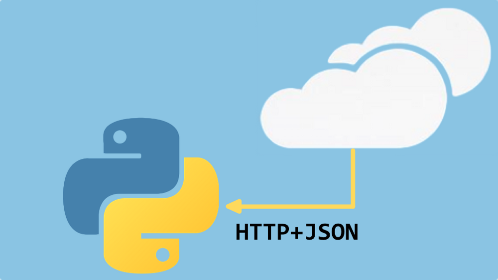
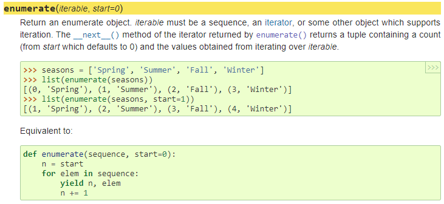
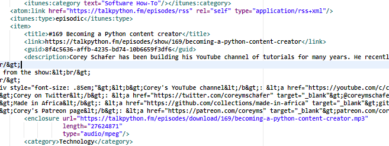
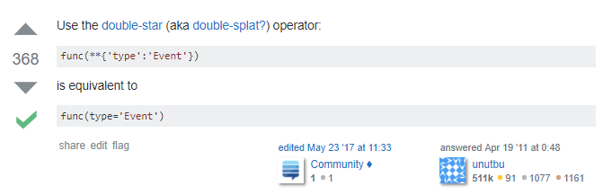
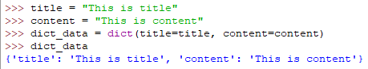
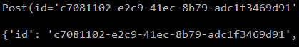
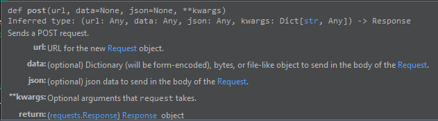
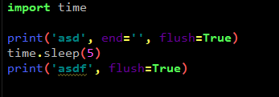

Every time I think Python can’t get any better I am proven wrong and this is proven again with how well it works with online data. This is my continuing journey to currently learning Python and specifically with Michael Kennedy’s library of [courses](https://training.talkpython.fm/). The ironic (if I’m even using that correct, I’m not a writer people, I’m a programmer 😋)part is that even though this course is shorter than the 10 project one I did before, this one is taking me longer because for me at least, it’s a more advance topic as I don’t know much about Service Types so I spent a lot of time researching a lot of words Michael would discuss as well as some of the libraries he used which I definitely recommend anyone not really familiar with these topics to do the same. I’ll break down each section and my experience. Like always, hope this helps:

#### The Service Landscape
You begin by learning the different types of services and there pros and cons. I won’t lie and say I completely understood everything but not for lack of excellent explanation. I just think I make topics more difficult than they really are but it gives a good overview how these compare.

#### Initial HTTP GET requests with the requests package
It’s pretty amazing that first time you pull information from a website and this section is like the “Hello World” by making a simple GET with the request library with his website and like most of the concepts in the course, he uses diagrams to introduce the flow of what is happening which helps with what can sometimes seem abstract.

#### Reading JSON data with requests
I come from a Javascript background so JSON is what I definitely comfortable with and I think today, most people are because it has a nice readable structure. In this section we get dive into working with JSON and how exactly to extract information from GitHub accounts. I didn’t know you could actually do that to Github so that was pretty interesting. For anyone that knows JSON, you know that it’s all just digging into the data through a hierarchical structure and those who don’t, trust me, it’s easy to parse through.

#### XML Services with requests
So here is where I hit sand and slowed down a lot. I actually skipped this section initially because I thought “When am I going to worry about XML” but then thought better of it and instead went through it at a snails pace because I have never dealt with XML. After taking my time and going through it I realized it wasn’t that bad it is just not as structured visually as JSON. I had never used the enumerate() function before, which is used in this section, so I looked it up and for anyone who is interested here is a little more information about how it works and what it does and as I wrote this I looked on top of that page and shows the built-in functions…that’s always handy.

#### Binary data from services(and elsewhere)
If the last section was sand, this was a sand wall where I really had to slow down to get past it. As you go through this section you will find that you are once again dealing with XML but below I have put a link to a website where it makes xml a little easier to read with colored tags. Just copy it from your source on your browser, paste it in there box, click Format and beautiful, or as beautiful as XML can get. Did I say that this one was a slow process, okay, just making sure but the pay off is huge as you actually download mp3 files. I can see so many applications for this knowledge but understand, you have to make sure you have all the pieces just right so let me say this clearly…TAKE YOUR TIME. I think I’m saying that more for me because I am really impatient but onward to download everything on the internet.

http://www.webtoolkitonline.com/xml-formatter.html
#### Consuming RESful HTTP services
This section turned out to be one of the most difficult ones for me because there were some concepts I really had to research. The first thing I had to do was break down even that starter code to really understand what was going on and that included what I actually commented on my own code, what max_width and padding actually meant. The next big road block I hit was understanding the kwarg and how Michael used them which I won’t got into detail but the following images below show how we turn dictionaries into keyword arguments.

https://stackoverflow.com/questions/5710391/converting-python-dict-to-kwargs

How dict() works.

Top is using our **post vs the bottom which is our post variable
https://www.digitalocean.com/community/tutorials/how-to-use-args-and-kwargs-in-python-3

As you can see from the above, it took me a while to really grasp what was going on but my main learning was from using they Python repl and play with it until I understood how dictionaries relate to keywords. 
Once I understood the get_post() function the add_post() became a little easier to wrap my head around since we would just use the request methods to put in the information we want with the POST verb. Below is what the post verb asks for when you add posts to our blog.

One of the main things to keep in mind is the status codes that are used to make sure our data successfully executed regardless of action we choose and he definitely speaks on which are used for each action. Some of the concepts with requests I struggled with because I believe I probably need to really examine the requests documentation but like most of this course, it just shows you what is possible and it’s up to you to really dig deep, including into libraries, requests being the most popular one around. Finally delete is the last or CRUD actions and again we use to documentation for the made up blog Michael creates on his site and see how to execute this. This was the easiest one but most likely because we had already done a lot of the work before.

#### HTTP Services with Python Builtins
I only have one thing to say about this section…Thank god for Kenneth Reitz for creating requests!!

#### Calling SOAP Services from Python
So I won’t lie to you and say I was excited about this section because to me, at least initially, SOAP seemed like a legacy protocol but that tells you how much I know about this which is just to give you an indication of where I am coming from. So Michael did a great job explaining something that for me was very abstract and up doing some research on where it’s still used, Stack Overflow says that B2B is where it’s still used which I can actually attest to because I deal with a CRM system, Netsuite and SOAP is on a lot of job posts. With python though it seems like it’s a very difficult process since we now have Requests to the rescue. Still found this to be a very useful section even if it’s just to give a great overview on a protocol you might or might not deal with.

#### Access Authenticated HTTP Services
Once again Requests comes to the rescue on making authentication so much easier but like most sections, Michael takes time to show other methods which include the built in methods and using SOAP and suds. The two latter or just ugly but again, you might not ever remember how to do it but just remember that there are ways to do it.

#### Screen scraping: Adding APIs where there are none
NOTE: I did this without BeautifulSoup and instead used Kenneth Reitz new package, [Requests-html](https://html.python-requests.org/) which is pretty awesome and pip installable. 
So I decided to challenge myself a little after my last meetup exposed me to this new package that brings BeautifulSoup and Request together, which elongated this section from 30 minutes to 2 days of researching and trial and error. Now I do have to say I really have no idea if this way is better but it was more to see if I could make it work and I did, but like the beginning song of Talk Python says, “Anyone can get the job done, it’s the execution that matters” which I’ll be honest, I have no idea how well I executed this and would love to hear what you all think. Back to the section though, Michael goes over scraping with XML which besides the part where we work with the sitemap, I still don’t really understand why we use it on regular HTML. I would advise any beginner to really dig deep into this section especially in the details like when he adds flush=True which lead me down a rabbit hole but ultimately they learnpython irc channel helped with the following explanation:

>hey thee, thanks, what is the difference between flush=True and flush=False?

>**Akuli:** tragicwhale, if your print ends with a newline and you’re printing to a terminal (which is probably what happens), no difference

>**Akuli:** if your print doesn’t end with a newline and you’re printing to the terminal, it actually gets written, try print(‘asd’, end=’’) followed by time.sleep(5), and try flush=True there

>**theelous3:** “Whether output is buffered is usually determined by file, but if the flush keyword argument is true, the stream is forcibly flushed.”

>**Akuli:** tragicwhale, if you are printing to a file, the prints are not visible to other programs until you close the file or flush it, and flush=True flushes it

>**Akuli:** making sense?

>**Akuli:** (theelous3’s quote is correct, files that print to the terminal flush on newline)

When I ran this little test, with False, all text is printed at end, with True, asd prints first, waits 5 seconds, then asdf prints.

The rest of the scraping you can see in my code how I did it with requests-html and again, by no means do I say it’s the best way, just different. The section on controlling your user agent was the same as well and I again used Requests-html.

#### Conclusion
Once again, I learned so much and definitely pushed my limits of the knowledge I knew about Python which only made me more excited to learn so much more of it. Don’t let the short length of the course fool you into thinking you won’t learn that much, as a matter of fact, I was pushed more in this course than in the last course of [10 projects](https://training.talkpython.fm/courses/details/python-language-jumpstart-building-10-apps) which was awesome as well. Now Michael doesn’t dive into every detail of what he does but I found that to be a great thing because it forced me to do my own research and really understand what is going on. That is not to say I didn’t finish with questions or concepts that weren’t totally understood but I think that is just the nature of being a programmer. Once again, another spectacular course from [Python Talk Training](https://training.talkpython.fm/courses/all).

[MyGitlab](https://gitlab.com/RogerDodger-Python/Consuming-HTTP-Services/tree/master/http_services) account with how I solved some of projects.
