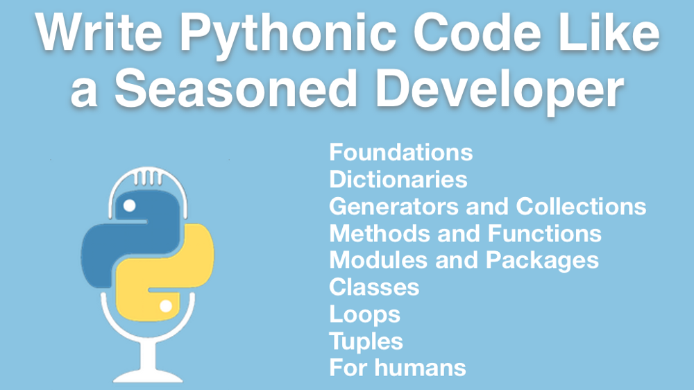
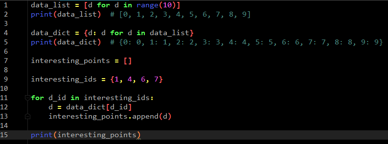
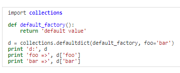
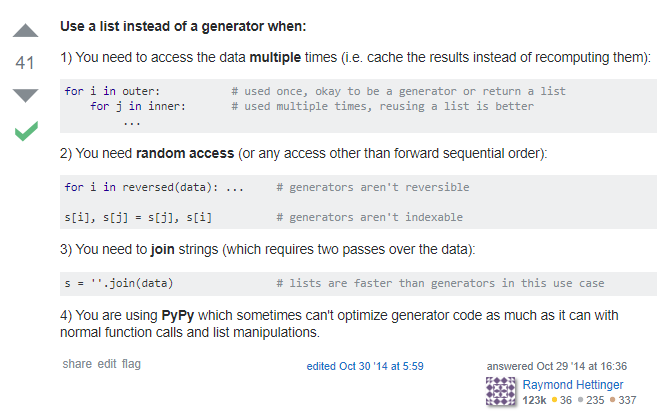

Now into my third [Online Video Courses at Talk Python Training](https://training.talkpython.fm/courses/all) and I figured I’d now not only learn standard practices of how to wrote Pythonic code but understanding the reasoning behind it. I’ve been exposed to many languages like a lot of us in the development arena like C++, C, Java etc and I can say that finding out their were rules to writing Python code was music to my ears. Python is truly an amazing and beautiful language and I knew that the last thing I wanted to do was to make it ugly so naturally I chose this course to steer in the right direction and ultimately making other Python developers proud. As always, I’ll write after each section my experience and any pitfalls. Thanks again Michael Kennedy for another great topic.

#### Style Guidance from PEP8 
Today the new hotness in IDEs is Visual Studio Code which I actually did use for a short period but to me the ultimate IDE for Python is still Pycharm. One of the things it’s amazing at doing is showing you when you violate PEP8 formatting and in this section, Michael goes over just a quick overview on some of the best practices. Doing just these basics I believe help make your code way more readable and personally, now I know more about using the triple double quotes to explain what a function does as well as what the parameters are.

#### Foundational Concepts 
It is very true that old formatting concepts from other languages can interfere with the elegance and philosophy of Pythonic code. In this section, we get exposed to many things but I found the concepts of truthiness, random, and flatness to be the most interesting because as someone trying to really understand Python, seeing how important in can be to understand the built in library to shorten your code cannot be understated which was the case with the random package. I remember learning C++ in school and how we should avoid ! whenever possible when doing comparisons but Michael definitely gives a great example on when to use the not keyword to prevent what is known in programming as the [Pyramid of Doom](https://en.wikipedia.org/wiki/Pyramid_of_doom_%28programming%29).

#### Dictionaries 
So this was a tough section and I actually had to really simplify the code because I think a lot of people learn in different ways and the best way I learn is to make it as basic as possible and grow from there and what I did was rewrite the code with instead of half a million numbers, I used 10 for the data_list and 4 for the interesting_points. Since it’s such a small program I’ll show it to you below and I actually really recommend you strip it down to really understand what is going on.



Not trying to spoil what you will be learning but again, as you can see, this might be easier to breakdown if the code Michael presents is a little overwhelming like it was to me. With this you soon realize why dictionaries work faster, you are going right to the index specified in the interesting_ids which not to get too computer sciency but the Big O is definitely better since you aren’t comparing anymore and instead just assigning and that is all I’ll say before I start sounding like someone trying to sound smart…ha. Even though I had to break it down I really appreciated how Michael uses big numbers as to really show the time differences as to represent the benefits. Another surprise he has is how to use kwarg to merge dictionaries which was “holy crap” moment for me, but I won’t ruin it. Then he speaks on Hacking Python’s memory but I feel like it’s great to know it’s possible but won’t worry too much about not knowing the details of this. The bottom image is to help a little with the defaultdict and how it works, again, simple example not that Michael’s weren’t simple, maybe just another different example.


https://pymotw.com/2/collections/defaultdict.html

#### Generators and Collections 
Generators are one of those topics that you scratch your head at first but when I took Michael’s 10 project course, I got to see exactly how awesome they were and how little memory they use. He does a better job at illustrating it but just think of it like having to move a barrel of apples from one place to another and memory is the energy you exert. Obviously you only have so much energy and there is a limit to how much you can do at once but one by one, you could do that all day. I do wonder why not always use generators and luckily, someone asked and someone answered this on StackOverflow.


https://stackoverflow.com/questions/245792/when-is-not-a-good-time-to-use-python-generators

#### Methods and Functions 
This was my favorite section as it discussed something that I struggled with when I first started using Python which was overloading which was one of my favorite concepts of C++. If you have never had to use that before I’d recommend really taking your time with this section as it’ll prevent you from having to rewrite code for small changes in parameters. One of the best things I have enjoyed about going through these courses but especially this one is Michael breaks down the god between good and bad so you can see how different something accomplished. It simultaneously creates a connection of how maybe you executed code in other languages and the way it’s done in Python since a lot of time the syntax is very different. I’ll be the first to admit that coming from doing loops with for 
```javascript
int i = 0;i<x;i++ 
```
to using for in with Python blew my mind, but I’m getting ahead of myself and the course since we haven’t reached Pythonic Loops just yet. The last video of this section was amazing because as clean as default values are, there are definitely things you have to be very aware of, hence the title Beware:The danger of mutable default arguments. Lastly let me add to not overlook how Michael uses Pycharm because I never knew that block highlights of code actually meant something but just another reason Pycharm is spectacular just like this course.

#### Modules and Packages
This was a short section but it creates a good foundation on how to do imports and one fundamental that I didn’t know about was the requirement.txt file which is a little embarrassing considering how easy it is and I definitely think it’s one of those things beginners should learn right away. Some other concepts I learned in the other courses I was taking but it was nice to revisit them because repetition greatly helps in remembering these very important techniques.

#### Classes and Objects
Coming from different languages, it can be a little confusing how to really code Pythonically and this section is where you really understand how Python tries to make it easier. One of the first topics in Java I learned, like many, was getters and setters and I do remember trying to do that in Python, I know the horror right. With this section, no longer will I make that mistake and nor will you. :)

#### Pythonic Loops 
I’m pretty comfortable with loops but one important concept I learned in this short section was enumeration of loops. Sometimes it is important to have an index and Michael concisely explains the best way to execute this. Every time I think I won’t learn something, I’m always wrong.

#### Tuples 
“It’s the commas, not the parenthesis that make the tuples…” This blew my mind because I always distinguished dictionaries, tuples, sets and lists by the brackets or parenthesis. Oh, and unpacking multiple values to multiple variables in one line also just amazed me. I have seen these done before but it was nice someone officially explaining what is going on explicitly. Computer Science 101 teaches about swapping values and lets just say Python does it the say we all thought of it when we first started learning programming…Python magic. Speaking of magic, this section shows another example of tuple unpacking which I can’t state enough, shows how elegant it makes multiple value returns. Definitely a topic to keep in mind and bookmarked. One of the consistent libraries Michael uses in his courses is collections and I didn’t really understand how it worked but he discusses how it works and why you should use it. I’ll always use it now.

#### Python for Humans 
I’m pretty comfortable with Requests package but actually had no idea about records and more than anything, it help me start piecing together how different languages can work with databases and this is a prime example with [records](https://www.kennethreitz.org/essays/introducing-records-just-write-sql). Either way this is a great small section about how to use Python to build anything without reinventing the wheel(package).

#### Conclusion 
This should be a reference for anyone trying to be awesome at Python. I have been using Python for a little while now but to watch Michael going over some of the standard packages and explain how they work really helped to embed in my mind when to use them but even more importantly, not only to not be afraid to use them but realize how powerful and easier it will make your coding life. I wish there was a book version of this course as I’d carry it around me all the time but like all his courses, Michael provides his source code which I think is just a good to have as examples of how to Pythonically write code. I feel like a broken record but this is another amazing course and whether you choose to take it as your first course and later like I did, the concepts and techniques you learn will be extremely valuable. Now I can feel confident in how I write my code.