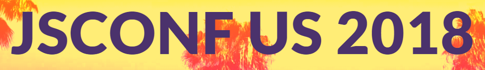
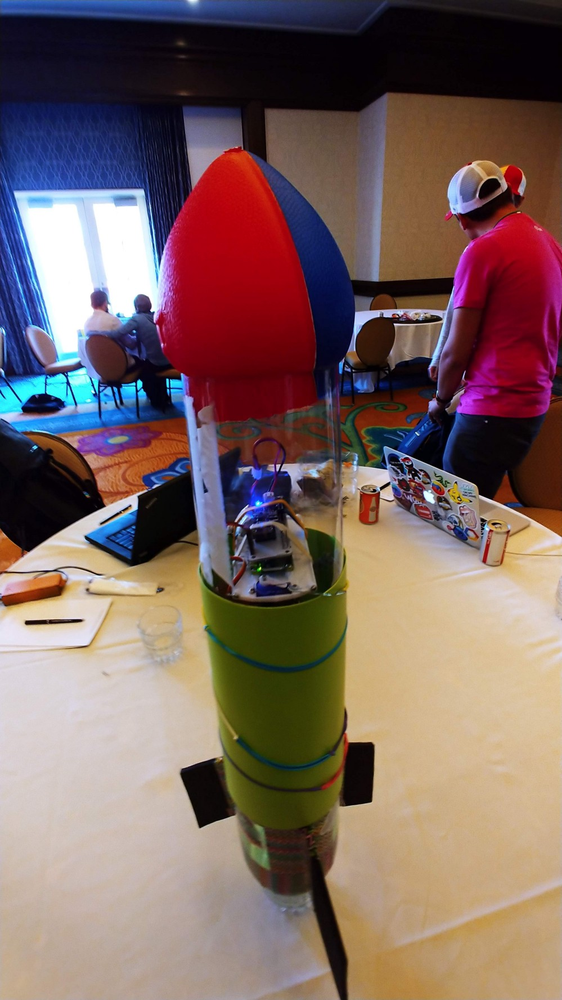

So a little over a week ago I was fortunate enough to attend my first tech conference and it was definitely something to remember. It was more than just the conference itself though that made it a great experience and I will elaborate exactly what I mean. End the end though, I was completely pumped to learn so much more and attend not only another conference, but also attend even more meetups. I hope that by sharing what I have experienced and learned, it might help you when you got to your first as well.

#### Day 1
My anticipation for this day turned to anxiousness the day before as I didn’t know what to expect and more importantly, how I would interact with people since I was going by myself. I decided to commute about an hour and 20 minutes each way each day, mostly because I have a furry one at home and a wife I wanted to come home to every night so the parties actually didn’t intrigue me, granted this are some commutes every single day for work. Ironically, I was listening to my favorite current podcast, Talk Python To Me on my way to a javascript conference but I’m just trying to keep all I have learned about Python still fresh. I finally arrive and it is a really nice resort in Carlsbad. First thing first, I get my badge and it’s off to breakfast. It was really an awkward initial experience because I didn’t really know how to open a conversation with anyone so I just ate my breakfast alone figuring out how I would talk to people. Eventually, breakfast was over and it was time to find a seat so when I walked into the conference room, I looked around and decided to suck it up and sit up front and I saw two guys that I figured I might as well ask if it was okay to sit at there table and they ended up being very welcoming. We discussed where we were from and what we do and this would be my introduction to how brilliant all the people I would talk to were.

I actually had no idea that the person I was sitting too would be the first presenter so as the conference started, he was introduced and the topic he spoke on was such a fascinating one. It was entitled “Learning through Art: An Introduction to VR” by Billy Roh and it was one of those talks that people were talking about in the hallway meetings. So this leads me to my first lesson…

##### LESSON #1: Talk to everyone, you never know who you will be talking too.

Now not every interaction was a win but you move on and keep enjoying the conference. I think by doing this I met about 20 or so people so I considered it a successful day because I got to hear 20 different stories and expertise. The great thing about having two tracks is being able to move from one room and back and every time, scanning the room for someone new to meet. I found that the majority of the time, the tables I would sit at would have very courteous.

Lunch time was another awkward time because I got my food and then had to figure out where to sit and happened to find a guy by himself, John was his name and he was actually very social and we ended up having a great conversation about his move from Nebraska to Idaho. Amazingly, I found that the majority of people I interacted with were not from California which made it an even better experience. Lunch continued and eventually we had more people join our table and I was so intrigued with everyone’s stories that the sun came out and was beaming so hard I was sweating, worth it though. As we were leaving another guy sees us about to leave right as he was going to sit down and laughs because we were all leaving but John being an awesome person said he didn’t mind staying to join him and I followed suit but I was in dire need of my sunglasses so before I left briefly I introduced myself and he reciprocated. His name was Gavin and actually ended two days later being the speaker of one of the most impressive talks of the entire conference. Again, you never know who you will run into.

The rest of day 1 was pretty typical I believe for someone who had never been, a little awkward and just trying to get my bearings. I left that day a little discouraged about the experience but the next day would more than make up for it.

#### DAY 2 — NodeRockets
So when I first bought tickets for the show, I saw that there was an activities day on day 2 but the best part about it was I could bring a guest. First it was awesome that they had the NodeRocket team there and second, I could bring my wife for free. My wife had never really been around the developer community and this would be a great way to introduce her to it. The problem was I still didn’t really know if she needed to have coding experience because she is an architect so we went we drove back to the conference that they, we really didn’t know if we were going to be able to do it because of that little detail of whether she needed to know how to code. Upon arriving, I think I was attacked by like 5 mosquitos in the time span of 5 minutes but more importantly, I asked the NodeRocket team if my wife needed to code, those guys couldn’t have been nicer and more awesome. They responded that ofcourse she could still join and I remember one of the members Steve replying, “Well if she is an Architect she can definitely build the rocket.” which made me laugh and set the tone for the day.

We sat there waiting for the day to officially start and a guy joined us at our table, Mike, from Chicago. This guy was spectacular with soldering and putting all the pieces together for the rocket and had such an amazing mentality of whatever he didn’t know, he would learn. Then moments later, through some serendipitous fortune, Marilyn joins us and we learn she is from Singapore but even better was that she was trying to really get into developing. Why this was such a perfect event was because my wife actually ended up really connecting with her as they both didn’t know much about programming but loved being part of the process of building the rocket which they did amazing at. Finally, Almir, which I hope I don’t get this wrong, was born in Bosnia but grew up in Austria. He had the unfortunate story of how the airline lost his luggage. He was smart enough to leave is drone in his luggage though because he ended up getting some great footage of the day.

The task was officially on and it was time to build this rocket, something I have never done before with node, I have only done those diy rockets you buy at hobby shops that fly 1000m which are so much fun, but back to our bottle rocket. As I said, my wife and Marilyn spent there time building the rocket, Mike did the board soldering, and Almir and I ended up working on the software portion. Admittingly, I spent most of my time puzzled by the software more than actually creating anything but that is where the NodeRocket team comes in.

In no particular order, Tom, Gabe, Dallin, Justin, and Steve, these guys were so amazing and that can’t be understated enough. Example, I was constantly having issues trying to understand the mission-control code and Dillan actually came over and asked me a question, “So what framework do you use?”. I have to admit, I was embarrassed to say I had never used one but not only did he not look at me like I was from another planet…haha, rockets…aliens…anyways…he actually pulled up a chair, and we spent the next 15 minutes going over how to implement the feature I wanted to add to my mission control. In this instance it ended up that we were using Vue.js which I have never done. It was actually very fascinating watching him and how he would solve something even he didn’t know sometimes. He could have just said he didn’t know and not worry about it but the methodology and patience he showed was not only appreciated but kind of inspiring. Justin was the same exact way and what was pretty awesome in a weird way was that these guys were never shy about saying they didn’t know something which really showed how each had their strengths and their weaknesses. I’ll get to the rest of the guys a little later.

By this time Mike had finished doing all the soldering, my wife and Marilyn had finished building the rocket, Almir had got the on board Arduino board working with all the sensor and connected to the launch code. I had, with a lot and I do mean A LOT of help from Dallin, gotten the launcher to work on mission-control with buttons to turn on and off the air and water and launch button. We tested the parachute, check our code and now it was time to actually do our first launch.

Our final product, first JSCONF then the MOON!

The one thing that you notice right away with the NodeRocket team is how excited they are about being able to do these rockets. My wife and I actually ended up talking with Tom for a bit right before heading to the launch pad and we ended up talking about coil guns, rail guns and the engineering behind it. The conversation stemmed from how to make bottle rockets go higher and the propulsion system that you would need to make it possible. Again, the enthusiasm was so obvious and it even had my wife a little jealous how much joy there was in building a rocket.

The moment of truth has arrived, launch time. So the first time it flew perfectly up and perfectly down, but no parachute. Eventually, Almir ended up finding a bug that would turn of the code to deploy the chute. It crashed hard and destroyed the mount for all the boards but besides that everything seemed ok and my wife and Mike decided to repair it and just grab another mount and rebuild it. Try number 2, once again, no chut opening and the rocket this time went sideways almost. Here is where Gabe was determined to help us make sure we got a successful rocket launch. He helped rebuild it once again and did everything to straighten the bottle to keep it as aerodynamic as possible but we had our doubts. So after another time of repairing and remounting, it was time. Try number 3 was the charm! Excitement is an understatement, at least we finally had one and it was a glorious feeling even i if it got stuck in a tree. Oh yeah, don’t use Fanta bottles, they are weak and will pop as we learned from another group.

This was such a great experience and for me the ultimate metric was my wife, a non programmer, had such a memorable time and even she made friends. So to all who wonder how much fun it is to build NodeRockets, just imagine flying to space, and multiply it by 10. ;-)

#### Day 3 
Back to days of some amazing talks which I won’t go into too much since I’m sure there will be a lot of posts on all the talks. What I want to say about Day 3 is that after having an ok first day and an amazing second day, I was ready to take on the final day of the conference. So I asked myself what my strategy to meet people this day would be and it was easy, activities day. I could just ask anyone what activity they chose and worse case scenario, they didn’t, I could always ask them what they did instead. This ended up working perfectly as a conversation starter. I arrived and grabbed some breakfast and went to sit down with another Mike, we talked for a bit but then more and more sat down with us and they all shared their previous days activities. These activities ranged from surfing, kayaking, to going to the zoo or safari park. This worked all day and would make the day so easy to meet anyone but upon sitting there for breakfast I realized that I could also make it work the other way around.

##### LESSON #2: Let them come to you
The seating area had partial tables in the shade and the others in the sun and I realized that the shaded area was completely full so at that point I decided to get to lunch right after the talk and sit at any table in the shade and eventually people would come to me, all I had to do was introduce myself. I ended up meeting one of the guys, Alex, that also did NodeRockets but was on another team. I also met Sarah who had a fascinating story about coming from another industry and now is a developer at Nordstrom’s after a year of looking for a job, that is a hustler mentality I can always appreciate. Eventually all the seats were pretty much taken and then a guy sits next to me and he ended up being from Israel. We ended up talking about his security company that he works for which ended up being really interesting topic about international relationships as well as even the culture in the dev community. Ended up being a great mind stimulating lunch to say the least.

After some more set of talks we had a break and while I was outside in the hallway on my phone I ended up seeing the NodeRocket guys again which is always great to talk to those guys. They did end up telling me though that one of my partners for the rocket, Almir needed the rocket back because I had forgotten, he actually used his personal sd card, which he needed back. At that point I was determined to get it down from the tree. While I went to get a broom stick to get it down, Tom already got a flag pole and by the time I got back to the spot with a broom, the rocket was nearly down from Tom poking at it. I was actually excited to get back the boards because there were so many sensors I could reuse. While walking back I ended up talking with Dallin more and he did tell me it would be a beneficial for me to learn React. I can say a week after the show that I ended up learning the basics which I am proud.

Sometimes I feel like there is so much to learn but then I realize I’ll never get bored and won’t ever have to worry about not learning something.

The last person I met was a guy, Fabrice, and he also actually ended up being a fascinating person because he actually didn’t have a degree but worked, learned and networked enough where he found his opportunity and took it. This was definitely a great finish the a really great conference.

In a nutshell, what I got from my first ever tech conference was to learn a framework, especially React. Also, the people you meet at these conferences are some the most brilliant people you will meet. I almost felt like I didn’t belong but then I realized all it did was motivate me even more to be great developer but not for only for my own personal goals, but to also help the community on their own projects. It is definitely a very collaborative community and I’m exhilarated to be part of it.

All in all, amazing first tech conference, I think I might have gotten spoiled for any other conference but my next big one I hope to attend will be pyconf so we will see.

Thank you JSCONFUS for putting such inspiring people together. See you next year.