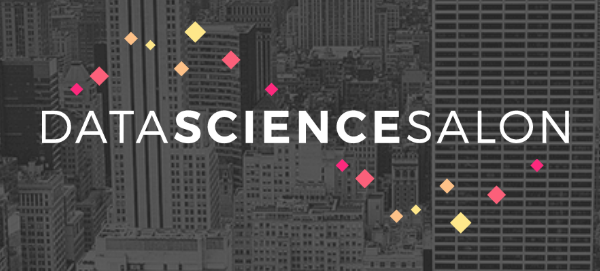

#### Prior to Conference
I attend a Python Meetup group monthly religiously now, even though I have to miss my next meeting because it’s my wife’s birthday…priorities. One day the organizer of the meetup asks the group on meetup.com if anybody would be interested to go to a data science conference for free. It was a no brainer for me so I emailed right away because it was first come first serve for the first three. I was lucky enough to be chosen so I marked it on my calendar and waited about month and a half to attend Data Science Salon Los Angeles. Honestly, I had never heard of this conference but I was excited to try something new.

A little about me and why I chose to go to a conference I know little to nothing about. I’m what you would consider a late bloomer in the computer science field let alone data science. I went back to school at 30 while working full time and now I am going to my third year into my undergrad but one question still looms over me, what do I want to do ultimately? I wish I could have had the last ten years back on got into programming a lot sooner but I keep Tony Robbins’ words in my head that I will paraphrase best I can:

*Someone asked him how long it would take to be good at something and he replied that it would depend on that person and how much time they put into it everyday. You can put in an hour everyday and be great in 4 years or put in 4 hours everyday and be great in 1 year.*

Today I know I am playing catch up by that is precisely why every day I am constantly studying and learning and it never feels like it’s something I “have” to do because I truly feel like programming is what I was meant to do, I love it. Back to the conference though, I am still considering all my options and data science had always been very intriguing and felt that this conference could be the exposure to real data science.

#### Conference Day 
Finally the day had arrived to attend Data Science Salon LA but first, it wouldn’t be LA anything without traffic. It took about 2 hours to drive 40 miles and I ended up being 20 minutes later than I had anticipated as I wanted to get there to take advantage of there parking but luckily, parking was plentiful.

First impressions of the show was with a gentleman named Jorge who was doing the registration and happened to be a really nice guy and extremely helpful. His demeanor definitely made it feel welcoming which relieved a little of the slight anxiety I felt going to another conference where I didn’t know anyone. It’s true, going somewhere you don’t know anyone let alone know little about the topics they would be talking about can sometimes be intimidating but if I learned anything at JSConfUS conference, introduce yourself, ask if it’s okay to join them and most of the time, people are welcoming.

The tables were of the standup variety and could fit about 4 people and happened to find one that only had 3 guys eating breakfast together so I approached them, introduced myself and joined them. This would be my first experience of the day with some extremely intelligent individuals. One was an MIT graduate, other worked in SF for a big company and the last one had a fascinating story of how he was a teacher until 2008. Once the crash occurred, he ended up getting fired 3 years in a row from the school districts which made him decide to pursue a career in data science. He did the grunt work of api documentation for a while and eventually landed a job at a successful startup. When I shared I got the tickets from I meetup I am a member of he said he was a member of a Python group in Orange County as well and I looked at him and said, “Are you one of the three?!”. The other two guys laughed because he thought I meant there were only three members in the Python Meetup which then we all laughed. So yes, apparently one of them was a fellow member and we just hadn’t met, but we have now…networking.

#### Talks (Before Lunch)
The second reason why people go to conferences, besides networking is the talks and for me, I was finally going to see how data science was used in the real business world and I won’t lie, some of the concepts were beyond me. Now I won’t get too much into the talks because they will be online and what more can really be said besides, so many brilliant minds and sometimes too brilliant for me to keep up. I didn’t necessarily find this discouraging per se, as you don’t ever want to be the smartest person in the room because then you have nothing to learn. The conference focused on the entertainment industry and generally was how to use all the data they collect from us as the consumer and like any successful business, tailor it to provide a better service. I’d be remiss if I didn’t talk about a speaker that really impressed me. I intend to one day be like one of these speakers that I watch but to be great at it you need to not only know the subject you are speaking on but also be a great speaker. Jen Walraven is the manager for Science and Analytics at Netflix and at first it almost seemed scripted but even as she spoke in casual conversation to audience members, it was with such fluidity in her speech and vocabulary that it was a highlight and example I intend to emulate.

#### Lunch 
Once again it’s the moment of networking and again I grab my food and am looking around to find who I can join. I end up sitting with another triplet of gents and once again I ask them what they did. One was a first year college student, the other was a graduate student, and finally the last gentlemen was a PhD data scientist originally from Sweden that now works for a gaming company. Talking with him was a very enlightening experience and as I stood there and listened to his experience working for a small but extremely successful gaming company, I looked around and realized the level of aspiration my peers at that moment had. It the plainest terms, bachelor degrees were equivalent to high school diplomas. What I mean is to say that these people I was surrounded by craved knowledged and it was that thirst that has propelled them to such successes. At first I did feel like maybe I didn’t belong but I changed my mentality and instead thought how I was surrounded by decades of experience, if there was anytime to ask questions, the time was then and there. I ended up asking Robert, who was the PhD Swedish gentlemen a the gaming company, what he would tell 3 guys like me, and the two others that were still in school and he gave concrete, pragmatic advice. He said learn R or Python and learn SQL databases which prompted a question from me about NoSQL and his opinion was that now with the new features SQL has, NoSQL might become obsolete. It might have just been an opinion but nonetheless it was an opinion from someone with years experience which lends itself to be taken at least into consideration. Again, I might be the dumbest in the room, but all that means is that I can ask more questions and you’ll find that people are more than willing to give advice and this conference was no different. Oh an Robert ended up being one of the speakers.

#### Talks (After Lunch) 
We actually started with a workshop right after that I had signed up that dealt with chatbots which I didn’t know much about so I figured it would be a nice crash course in what they do and how they work. The gentlemen teaching this workshop setup a demo and essentially it was what I thought it was but the amazing part is the discussions on how you can use a framework to create your own bots. He said it so nonchalantly but to me it was one of the most amazing things I have seen. I know machine learning is all the rage and to many in the industry it’s nothing more than a tool but to me it’s still some sorcery that is happening. Don’t get me wrong, I have a very very general idea how it works but it amazes me that someone or some team of people were so smart as to think of creating this and that is inspiring and motivating to be one of those creators.

After the workshop we had a quick break and more talks but during the talks before lunch there was a person that sat two seats over and we had said a brief hi to each other but not much more. After lunch I saw him again and it’s one of those awkward moments when you have seen each other more than once and most people still don’t know who should say hi first. I reached over and introduced myself and once again, I was fascinated by his story and why he was there. His name was Jordan and I remember when the MC asked him why he was there at the beginning of the day and he said he had just finished a course so I asked him about that. His bachelors was actually in Economics I believe and wanted to really get into data science so he took a General Assembly course in data science. Funny enough, my wife had been considering General Assembly for UI/UX so of course I asked all the questions I could think to ask on behalf of her and he couldn’t have been more informing and pleasant to speak with. I told him how a lot of it was over my head but he said since he had just finished about a month ago, he could really follow along pretty well so once again, what followed from me was another question. On of the biggest topics that seemed so elementary for everyone was regressions. Obviously I sat back and was like, Yeah…regressions, obviously everyone knows that. I asked Jordan though what it was and he explained it pretty simply as guessing other variables with the information and patterns you have. I guess General Assembly served him well and actually he was really happy with the course.

The last speaker was Jeanne Holm who is the Senior Technology Advisor to the Mayor of LA. She presented what the the City of LA is doing with technology to help make the city better. One of the programs is Hack LA which sounded amazing to able to be part of a group that helps local government make its city better. I live in Orange County and so far I have not found an equivalent but it did inspire me to think what could I do to help my city. Last year we were evacuated during the fires and got me thinking, maybe I can create an app that could send out and SOS directly to firefighters and firefighters could have a gps location of that SOS and when they got close they could activate a ring that would help them locate trapped individuals. Even better would be to have firefighters use the technology to locate each other. I know very little about what firefighters use today but with my brother trying to get in firefighting, I could just ask him. Monumental project but now at least I have an idea and can build it slowly.

#### Closing Ceremony 
The day was over and now, because it is LA, time to wait for the traffic to ease up some so I decided to wait around and do some networking. Met Andy who was from Cincinnati and was with his wife. He was originally from Cleveland an I learned a valuable lesson from him, you can wear any team jersey in Cincinnati, except Baltimore and that closed out my first Data Science Salon LA conference. The best thing about going to a conference that is over my head, you learn how amazingly intelligent people are even if you don’t understand what they do but in asking questions, you get a practical understanding of what there day to day is which is very valuable especially if data science seemed mystifying at first.