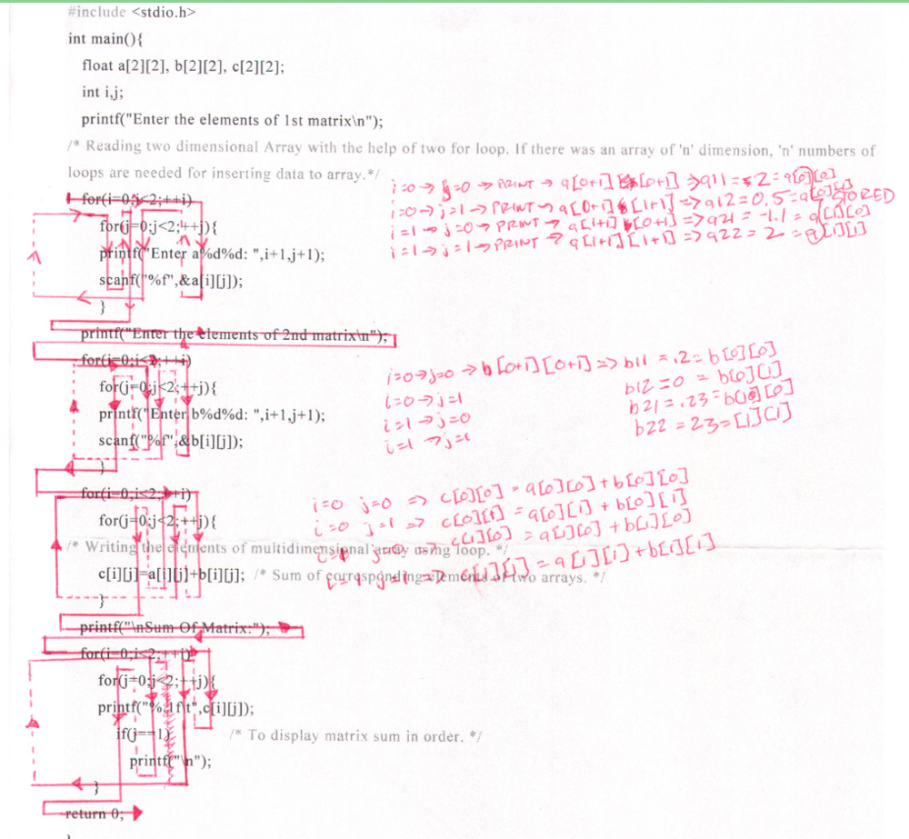

#### My History Before Going Back at 31
Back in 2001 I graduated high school and like everyone else I was asked to make a decision on what I was going to do for the rest of my life. The only way I could answer that was to think what I was “passionate” about, which at the time and still to this day is flight. So naturally I decided to go to school for Aerospace Engineering at Cal Poly Pomona which actually was one of the top rated schools in that study at the time and it happened to be driving distance from home. On top of that, I met the GPA requirement to be nearly a guarantee admission since it was a local school…different times. I won’t go into much detail about my time at Cal Poly as this is really about what school was like at 30 and into today which I am now 34.

My time at Cal Poly was a very lost one and what I mean by that is I really felt that I just barely made it through most classes and truth be told, sometimes I think back and don’t know how I made it. I felt lost most of the time in my Aerospace classes but I will say, to this day I am most proud of two As I received, Chemistry and Dynamic Mechanical Engineering but distinctly remember putting in a lot of time for each of those. If you ask me today why I didn’t do that with all my classes and I’d have to say I think I just felt overwhelmed and almost like my head was perpetually clouded with the discomfort of not knowing which created a perpetual cycle of feeling worse about myself. This would definitely creep back up in my current stint of school but later on that. So when did I leave college and why? Towards the end I was only taking one or two classes a quarter and even would skip a quarter here and there so it was 2007 and I had already amassed $10,000 in loans and was afraid to take out anymore and so I decided the full-time work force it would be for me. Truly, I never thought I’d go back to school once I left and I would feel this way for another 8 years. It wasn’t all for nothing at Cal Poly, the best thing that happened in my life happened there, I met my wife and that in itself was definitely worth the loan I paid back.

The years in between on my professional life consisted of about four jobs that varied in their focus. When I dropped out I was working at a door hinge company doing there graphic design, web design and even mechanical design of all the products. It was a great job while I was in school and nothing bad could ever be said about the company but I knew that I had reached the highest I could there and it was time to move on. At this time I was looking for a more technical road and started applying for IT jobs because it was always something I was decently good at doing. Eventually I landed a position at a major cell phone carrier subcontractor and I would find a lot of growth through a great boss that I would work under for the next two years. I learned everything from the simple user devices to servers to networking. In those years, I found a lot of joy in helping our construction crew to learn how to use their computers. They would always say how good I was and that they were just terrible with computers but I would always remind them that even though in their eyes I was Neo when he saw the matrix (as they would put it), that just happened to be my strength just like theirs was to build cell towers that help push this information to our phones, which I would be completely weak at. Even then, these guys would surprise me and teach me things about computers I didn’t even know. There was a lot of mutual respect and a great lesson at this job was to never look down on anyone because we all have weaknesses and strengths. You never know who will be the person to teach you your next lesson so just listen.

Eventually my boss ended up leaving and I had proven myself enough to replace him as manager of the IT department. I did this for about a year and when we brought in an IT firm, eventually I became friends with our IT guy and he got me a job at the firm so it was a smooth transition. I was only at this job for about 3 months because my wife had to have surgery and I needed to be close to home and this job was about an hour and 30 minute drive. I won’t lie, it was a high stress job and it did stop any interest I had in IT. I quickly was able to find another job closer to home in mechanical design but with concrete. This was just a contract job so only for 3 months. My next job would be another contract 3 month stint as well and for the first month, I really enjoyed it because my boss, who I actually based my decision to take the job, was such a great person to work for and an amazing teacher. After that first month though he announced he would be leaving which really crushed all my reasons for being there but I would remain for the remainder of my contract and in that time I really started question what I wanted to do because I realized I did not like mechanical design either and I was tired of wandering aimlessly.

During on of our daily hikes with our dog, I was talking to my wife I wanted to finally learn to code and so I started looking up classes or mooks. I attending an online course that Harvard has called CS50. It was really difficult and I would spend hours trying to decipher what the instructor would teach. Looking back now, learning C is one of the hardest languages to learn programming with but I usually am not one to take the easy road. It was tough but like any learning you have to tailor it to you but I was truly jealous of all those kids who got to go to Harvard. One of the topics that took me time to wrap my head around was nested loops and even though it might have been an unconventional method to understand what was going on, the following image is of the exact sheet and how I walked through each loop.

Tracing out my first nested for loop

I remember having a ruler and a red pen during my lunch hour and just tracing out every single step and even writing out the results on the right and realized it’s like a clock, first you let the minutes cycle and then the hours, and then the days, etc. This was my introduction to programming and when I knew I wanted to be in software.

#### Back to School (2015–31 years old)
Let me back up a couple of months into 2014 briefly. I watched a TED Talk and for the life of me, I cannot remember which one it was. The message was about not using excuses to make yourself better. I’ll admit, I used the excuse of spending time with my wife to not go back to school. This talked completely had me look in the mirror and I realized I’m responsible for my accomplishments as well as failures. This was the deciding factor in my return to college and what a polarizing experience it would be from my first experience. Amazing where your inspiration will come from and now I’m on a mission to find that talk so I can share with the speaker how his talk changed the course of my life. Oh yeah, a great piece of advice on twitter, always share how you appreciate someone’s work, no matter how famous they are, it really does help and I’ve been proven that multiple times when I show my gratitude to people I see as receiving it all the time and they return a heartfelt thank you.

Spring 2015 and I’m ready for school, or at least I thought I was. My first class back after 8 years was a general education class fulfilling the foreign language criteria, Japanese. I told you I never take the easy way…ha. I think the Japanese culture, in my limited knowledge of it is a beautiful culture and so that is why I decided to take this class. My first day in you would swear I was going to have a panic attack. I was so out of my element and to this day, I embarrassingly remember looking over to this kid just out of high school and telling him how uncomfortable I was just being there. I’m sure he looked at me and wondered what was wrong with me. Not one of my finer moments. Still, I showed up to the next class and every class after that and eventually got comfortable being back in school but it is evident very quickly, I am over 10 years older than the majority of my classmates but as quick as I realized that it also faded away. In the end, I was just another student.

Let me pause for a second and say, what a time it is to be a student. Everything and anything you need to learn can be learned online as well. I actually lived through the information revolution and when I first went to school, we didn’t have knowledge at our fingertips. Wow, that sounded like I’m old and if it’s in reference to technology, ten years is a lifetime.

I remember downloading apps on my phone to study the Japanese characters and even pronouncing them as well. Again, technology is amazing today. The class ended up being a great reintroduction to school even if this time it was at community college. If it wasn’t for my wife, I would have said I wish I had gone to community college first but like I said before, I found the most amazing woman I know and my inspiration to be a better man everyday so no, I wouldn’t trade that for anything.

#### Java
My next class would be my official first programming class…Java. Ignorance is bliss and at this time I lived in a blissful state not knowing anything about Java. My professor started the first day by saying if we had never programmed that we should try other classes first which did put a little fear in me that I might be over my head if I stayed in the class. I decided to ride it out and see what happens. Most of the semester I kept waiting for the other shoe to drop because it was all seemingly not too difficult but that day never came and successfully finished my first programming class. 
Lesson Learned: Maybe I can actually succeed in Computer Science.

#### C++
So I thought after Java that I still really wasn’t tested and figured maybe my next class would do that and it was C++. This turned out to be my favorite class during community college and also the most stressful. On the first day of class my professor said something that would remain with me to this day. He drew a graph that started shallow and then shot up quickly. This was called the learning curve for most people. Right before the graph shoots up is the wall that many of us hit and give up at but his point was if we just stick with it, we eventually break through that wall concepts begin to click. This would prove to be completely true for this class coincidently. For most of the course I was doing pretty well, surprisingly well, considering how difficult I imagined it to be, that is until the final project…Blackjack. We had to implement classes into our Blackjack game and classes were so abstract to me I could not solve the project. For 2 weeks I stressed, it was my wall. Then one day during my lab a classmate asked me to write a simple piece of code and the wall was broken. I came home and wrote 8 different versions of the game and I felt amazing. It was the first time I felt like a programmer. I truly felt like I would never understand and in all honesty, it wasn’t until recently that I fully understand how classes work but I persevered and succeeded which was obvious since about half of the class was gone by the end of the semester.
Lesson Learned: Keep pushing, even when you feel like you can’t.

#### C 
Just when I thought I was tested, I realized I had to take C and I didn’t really know what to expect. During the first lecture, the professor went over all the topics we would be going over and of course, the notorious concept of pointers popped up. On that day I told myself that if I didn’t learn anything else, I would know pointers inside and out. Now we definitely discussed many topics like bitwise operators, which to this day I don’t really know what they are used for, but I said this before, what a time to be alive and going to college. I say this because I read many articles and say many youtube videos about pointers and finally it clicked. I would not know how important this concept was until I began learning Javascript and compared the prototype chain to pointers. My advice to anyone learning pointers, take the time to learn pointers, it’s totally worth it. Oh yeah, linked lists were pretty fascinating as well.
Lesson Learned: Pointers

#### Data Structures
I remember hearing the name of this class before and thinking how fancy and complex it sounded. It’s amazing when the magic is shown to you and how accessible it is. I guess I had never thought about how all the concepts we take for granted in programming came from somewhere and it was very interesting to see queues and trees and different implementations. This is when the programming turned for me from code to science. 
Lesson Learned: Abstraction: You don’t have to know how something is done, just what it does.

#### General Psychology & Sports Psychology 
So I know what you are thinking, what could you have learned from these general education classes. I took these during summer so to be able to graduate by a certain time. The lesson in these classes was simple and now I understand Nike’s slogan. Since then, I workout consistently. 
Lesson Learned: You DECIDE to be healthy, it’s all in your head.

#### Discrete Mathematics
In all the courses I took, this would be one of the more mind bending one’s that I would take. Math had been pretty “binary” for me to this point, it was either right or wrong but this would turn all of that upside down and it definitely frustrated and pushed me. I remember in high school, the bane of my math existence was proofs and wouldn’t you know it, there was a class that would cause me this grief for 16 weeks. Between induction proofs and equivalence relations, this class still causes me nightmares. Sometimes you just do and hope that eventually something clicks and sometimes it did and others not so much. Once again, I succeeded and this is one of those class I am truly proud of doing well in.
Lesson Learned: There exist a class on just proofs, why didn’t anyone tell me.

#### Graph Theory & Linear Algebra 
This professor was one of my favorite and so was his teaching style. The only thing that killed me was we used his textbook and their would be mistakes. It was already bad enough that the class was difficult. Part of me wondered if maybe I just didn’t match up but at the end of the semester once again, those I assumed knew much more than I did were not there. Again, some of the topics were very abstract but I did learn that linear algebra is one of the most important topics in computer science, especially data science which would be very apparent with a data science conference I just attended. This again was one of those classes I watched many youtube videos to help me get a different perspective and how a topic could be approached differently. I remember dijkstra algorithm was one of these and it was merely rotating the table 90 degrees that made all the difference in comprehending the process. In the end, after multiple professor office visits, I made it once again. 
Lesson Learned: I still have no clue how this applies to programming but I want to.

#### World Civilization
I love history from WWI and on but before that I am just not that interested so I figured this class would be a chore. I was correct but that didn’t mean I wouldn’t learn something. We had to write about 4 papers a week and so my lesson by the end of the course was a useful one. 
Lesson Learned: I learned to write a lot, this post is a byproduct of that class.

#### Graduation(AS CS)
I almost didn’t attend this graduation because I felt like the Associates didn’t really mean anything and truth be told, in the professional world, it doesn’t. My wife told me it wasn’t for me, it was for her and who was I to argue with the smartest woman I know. Like always, she was right. I had her, my inlaws, my mom, and brother. The feeling of being able to finish what I started back in 2001 was exhilarating. It gave me that hype to continue onward for my bachelors and currently can’t wait to start down that road and eventually to my masters.

#### Conclusion 
Now I’m 34, about to turn 35 and so much is clearer. Maybe it was being in the workforce and having to actually produce product or maybe it’s just maturity which then again, it can be both. I’m excited to learn, it’s not something I have to do, it’s something I have chosen to do on my terms. During my time and Fullerton Community College, I constantly had a feeling of inadequacy which was good and bad. It was good because I pushed myself to prove to myself that I did belong there and bad because sometimes I put too much pressure on myself. I don’t think I’ll ever get over comparing myself to my peers but not because I want them to fail, on the contrary, I’ll help anyone that asks for it. It is a win win, I obviously know enough about a subject to teach them, and now someone else can be as much or even more successful than me. Success should never be exclusive because it typically never is. All my success I owe to the support I have received from my parents, brother, amazing wife and furry son, even though he truly hates when either my wife or I study since we aren’t paying attention to him. I love school and I have tried the other route before, self-study. That is for another post, another day. For anyone questioning whether they are too old to go back, let me say emphatically, no you are not, again, you’ll be catching up sure but it just depends on you how fast you want to do it. I love learning something new everyday and I can’t imagine not but even better is that I get to learn about what I consider my calling. Don’t wait, go do one class, one course, one degree, stick with it and break down that wall.