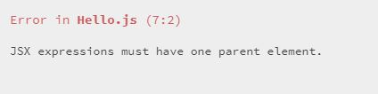
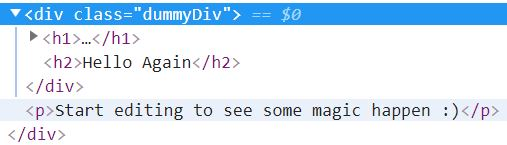
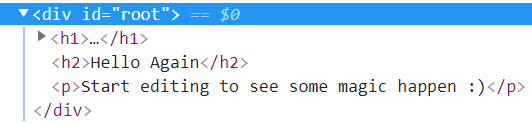

A nice little trick that I learned on [Wes Bos](https://wesbos.com/) course [React for Beginners](https://wesbos.com/react-for-beginners-re-recorded-again/) is how to elegantly have child components without having to wrap them in an dummy div tag that shows up on the inspector, muddying up the code. 

So for react components currently, if you have the following code:
```
import React from 'react';

export default ({ name }) => {
 return(
   <h1>Hello {name}!</h1>
   <h2>Hello Again</h2>
 ) 
}
```
___
The browser will yell at you the following.



Which is just saying you can't have two parent elements which is what both h1 and h2 tags are and up to this point you usually solve it by adding a wrapping dummy div like the following:

```
import React from 'react';

export default ({ name }) => {
  return (
    <div className='dummyDiv'>
      <h1>Hello {name}!</h1>
      <h2>Hello Again</h2>
    </div>
  )
}
```
___

The slight problem is that it makes your code messy because it adds it to your html code. I just added the className='dummyDiv' to make it obvious this div came from adding the wrapper parent div. 



This is where Fragment shines, if you replace that div with React.Fragment you'll see how it cleans up your html while letting you have multiple child components.

```
import React from 'react';

export default ({ name }) => {
  return (
    <React.Fragment>
      <h1>Hello {name}!</h1>
      <h2>Hello Again</h2>
    </React.Fragment>
  )
}
```
___

With this change, no more extra divs and your code looks beautiful once again.



Hopefully this helps clean up unwanted tags. 
