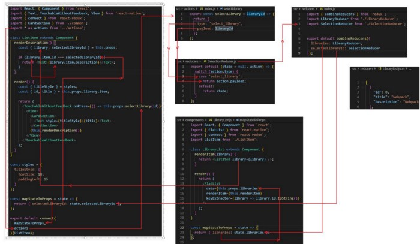

Web development is quite the rabbit hole, once you start you never know how many times you will be bouncing from technology to technology. Case in point, I have a new website to build at work but we are actually moving it from our ERP system to possibly have it hosted on Heroku. I say possibly which brings up the first choice I have to make, where to host it. Now this is not a guideline on how to break down all the technologies and what to choose, this is more about how many choices have to be made and eventually, you just have to make those choices despite feeling unsure you might not know something crucial about that service.

##BUILDING THE BACKEND
___
####Host--Heroku
I had a couple of choices and merely based on what I am familiar with like Digital Ocean and Heroku. Like I found with most things in web development, it really is just personal choice which makes it subjective to an extent. I know some of those services offer certain features that some need but I haven’t gotten that far just yet. Yes there are the big players like AWS, Azure and Google Cloud but wasn’t ready for that and wanted something a little simpler and not to say that Heroku is simple but it is easier to manage than the other ones for me. One of the biggest reasons I chose Heroku though is they offer a small free server which includes PostgreSQL which leads into why I chose PostgreSQL.

####Database--PostreSQL
Our current ERP system is based of a proprietary database that Netsuite uses and there is no direct access. Yes we can export and import information but we have found that to be quite difficult and the system is far from intuitive. I chose PostgreSQL because it has a great development community and it was still a relational database just like our current system. I’ve used it on small personal projects and found that docs are for the most part, really helpful. Initially we were going to use MongoDB but trying to use a NoSQL database seemed like it would be too experimental and with PostgreSQL, at least in the future, a new developer is more likely to have SQL experience and can dive right in. The choices we make now are long term so using too many experimental services could ultimately cost the company more later so you have to be mindful of those future costs and learning curves for new employees. Now we need to create backend APIs. Express to the rescue.

####Backend Framework — Express
To get the backend to communicate with the frontend or any service out in the internet, you have to provide a way to interface with the database and in comes Express. It streamlines a lot of the routing for the API and having built a small project with it, I found myself comfortable with it after a few weeks and think it’s a great framework and I would definitely keep using it. The syntax is intuitive and it is easy to make routes which can be as complex or as simple as you’d like it to be. So we got the backend, naturally we then have to figure, what about the frontend.

##BUILDING THE FRONTEND
Here where it begins to get a little messy, fun or both, depending on if you like to get tortured.
___
####Frontend Framework — React
One of the big players in the frontend game is Facebook’s React and pretty much everyone is using it and support and development is very strong, not to mention the docs being so accessible with the assumption you have at least a decent understanding of Javascript. That is not to say there is not a learning curve, on the contrary, it is a mind bender if you have never done SPA (Single Page Applications) as it took me about 6 months to finally understand how it worked at a fundamental level. I recommend really going through the docs slowly, take the time to learn each section before moving on. Once you begin to understand components, props and state, you are pretty much there. Build basic react apps, it’ll help tremendously. So why did I choose React over Angular or Vue, it’s popular and I don’t see it going anywhere. So ok, I chose React now what, well I need a state manager to handle logins…REDUX.

####State Manager — Redux
So I still feel like I am learning Redux and I can’t pretend to know all the syntax I code line by line but I do spend time to learn thing concepts I am uncomfortable with to build up my knowledge. Once again, build small, I actually printed out all my code from a small project and drew lines how it all related to each other and how Redux was passing information around, it was a cobweb but at least now I could visualize it.

I’m sure you look at the above and it makes absolutely no sense, even after I drew this out, still took me two days to decipher exactly how it all played out. So now I know how to manage my state, so how exactly do I want to design the webpage, from scratch or do I want to use Bootstrap, MaterializeCSS or a number of other CSS libraries or frameworks.

####CSS Framework — Material UI
I ended up finding that a framework built around React was Google’s Material UI which is not as easy as I thought it would be but like any technology, you just have to play with it. It’s been a slow process and at the time of this writing, I’ve managed to get the header partially designed, but it’s enough to test out how the links in the menu will work and test out the backend as well as routing…oh yeah routing, lets see whats ‘next’.

####Routing Framework — Next
So I knew very little about routing except for React Router but in my search for more information on how I was going to build this new website, I feel upon a tutorial that used Next. I had heard of Next but really didn’t know exactly what it did and still only half understand how Server Side Rendering benefits a website, but it’s okay, I’ve only been learning it for the last 3 days so I would probably say knowing half is pretty good. If any are familiar with Gatsby, it works in somewhat the same way, you create a pages folder and you put your pages in there and the routing is automatically created unlike react router where you have to create the routes in the parent component. According to NextJS website, it helps with providing a faster site as well as better SEO.

###CONCLUSION
I wrote this to at least show how many technologies go into building a website and I honestly don’t know what else I’ll be running into since it seems that every time I have it figured out, there is something else I forgot to account for and then there I go, reading the docs for something else I don’t know. This is a slow process, as it should be, building an e-commerce site is important and the payment portion, I’ll leave that up to companies that specialize in such a service, never sacrifice security. Oh speaking of security, OAuth, see, told you I’d forget something, OAuth is a great protocol for making sure login services are secure for your site. Again, leave security to those who specialize in it and just use there tools, you’ll be happy you did. Now my ignorance is probably the only thing that makes me think that I can do this mostly on my own as I am the only developer at my job. Maybe eventually that ignorance will catch up to reality and I will have to find a solution to finish the project, even if it means outsourcing, either way, I’ll at least by the end understand how many moving parts there are to building an enterprise website from the ground up, wish me luck.