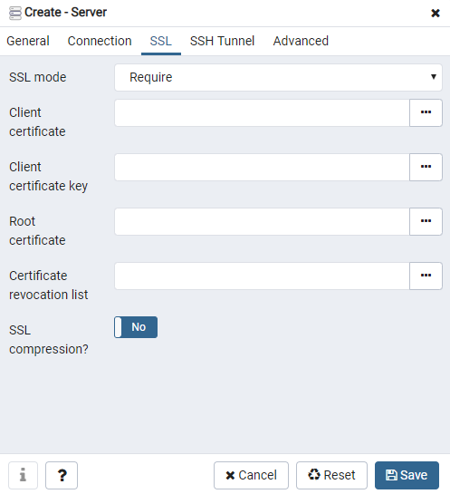
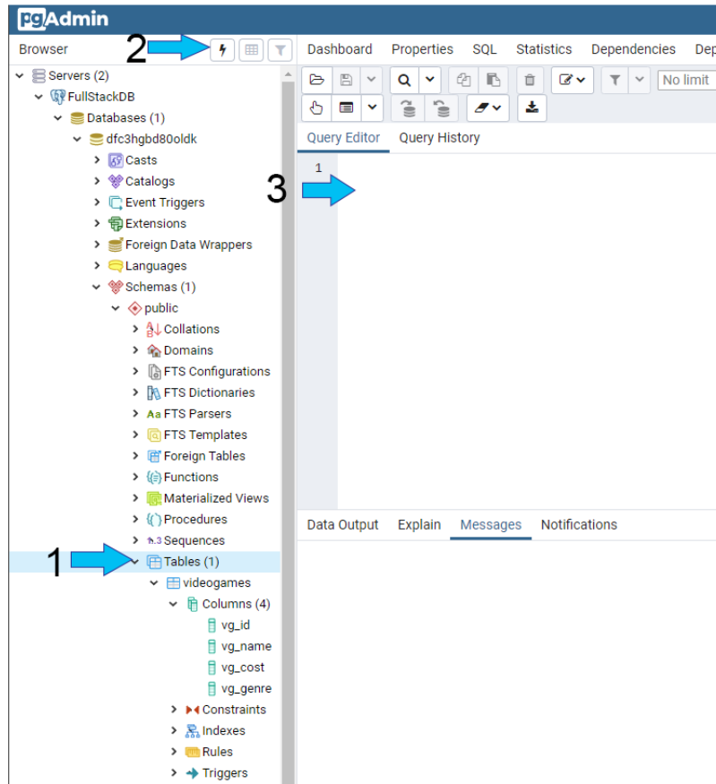

The process of building a full stack website is not an easy one and with technology constantly changing, especially the Javascript ecosystem, there are always new ways to execute the same product. At work I am in the process of building an ecommerce website from scratch but understanding how to get the frontend and backend built with a database almost became more than I could chew but I eventually created a working MVP to who my boss to give him an idea how the new website could work at a very basic fundamental level. It was a lot of research and scrounging through videos less than a year old that were already partialy outdated since there were already new techniques. I'm sure this tutorial will be outdated by tomorrow but either way, today it is still relevant so hopefully this helps anyone trying to attempt what I was told could either be a monumentally stressful journey or a fun one, by a Gatsby developer no less. This is by no means the best way, just the way I found it working based on docs of all the technologies I used. Enjoy ;)

## Database (PostgreSQL + Heroku + PgAdmin)
Lets start with first building the database which can be a little tricky for someone who has never done it. Now, I took multiple Udemy courses on SQL to understand how to do queries so I recommend that for anyone just jumping into SQL as well. 
- The first thing is download [pgAdmin](https://www.pgadmin.org/) which will be the how we initially interact with our database.
- Create a [Heroku](https://heroku.com) account, it can be confusing but the fact that you get a free testing environment is amazing. 

### --Heroku Datase Setup

Next we will now create a test database on Heroku. After creating your account you will be presented with the Heroku Dashboard page:
1. Click on the **New** tab


2. Click **Create new app**


3. Name the app whatever you want, I chose, fullstack-backend-example, we will be using this to also host our backend later, then click **Create app**.


4. Once on new app dashboard, click on the Resources and under the *Add-ons* section, type "postgres" and a dropdown should display *Heroku Postgres*, click on **Heroku Postgres**.


5. Another screen will popup confirming the provision of the postgres database. Click on **Provision**. We will be using the Hobby Dev-Free Version. 


6. Once successfully provisioned, you will see the following screen. Click on **Herokue Postgres** link.


7. We will arrive at the following screen, this provides information on your utilization of the database and on top there are a couple of tabs, next we will be utilizing the **Settings** tab to connect to our pgAdmin.


8. Click **View Credentials...**


9. The following show the credentials we will use to connect our Heroku Postgres database to pgAdmin so for now, lets move onto pgAdmin.


### --pgAdmin Setup

1. Open pgAdmin


2. We will create a new server. Right click on **Servers** > **Create** > **Server...**


3. First screen is the *General* tab, we will enter a Name which can be anything, I have chosen to name it *FullStackDB*.


4. Click on *Connection* tab, we will now go back and refer to the credentials in step 9 of the Heroku setup. For our example, they should match up like shown below. *Note: the Password is the password field in the Heroku credentials page.*


5. Click on the *SSL* tab. Make sure that SSL mode is set to require.


6. Click on the *Advanced* tab. On the *DB Restriction* field, enter the Database field value from Heroku. If you don't do this, you will get a long list of other databases and you won't be able to find yours. This is the last field to enter, once done, click **Save**.


7. Once successfully connected, you will see a dropdown for FullStackDB, don't worry about seeing Servers (2), I just hid my other production server from the list. Congrats, you have officially connected to the Heroku Postgres database but we know that we haven't added anything.  


8. One way we can verify there is nothing in our database is ofcourse just looking at the utilization screen on Heroku and another way is using pgAdmin to check the tables. As we can see, there are not tables displayed. 


9. There is no fun with an empty list so lets create one. We will right click on **Tables** > **Create** > **Table...**


10. The first screen shows a *Name* field, I will name it videogames (I wanted something different and I love videogames). 


11. Click on *Columns* tab and we will add 4 fields: vg\_id(serial to keep it unique and incrementing), vg\_name(simple text), vg\_cost(keep it simple to only dollars), and vg\_genre(simple text).


12. Optional: If you click on the *SQL* tab, you'll see the generated sql code.


13. Click **Save** and then expand the table field on the left to see not only the table name but also the columns that were created.
 

14. To view the current table, we first open the Query Editor by clicking on the Table(1) field and then the lightning bolt on top. This will then open the Editor.
 

15. For our specific table, our query will be :
```
SELECT * FROM public.videogames
```
Once this is entered, click the other lightning bolt above the query.
 

Another way to find out how to query your table is to right click on the table name > **View/Edit Data** > **All Rows**. This will open a Query Editor with prefilled unchangeable sql code to display your entire table. 
 

16. The following is what our empty table looks like right now.
 

17. Now lets add a couple of items in there to wrap up our database and have some data to play with once we start our backend implementation.
```
INSERT INTO public.videogames(vg_name, vg_cost, vg_genre)
VALUES
	('BLASTER MASTER', 10, 'Platformer'),
	('GOLDENEYE', 15, 'First Person Shooter'),
	('HALF-LIFE 3', 3000, 'First Person Shooter'),
	('F-ZERO', 5, 'RACER'),
	('STREETS OF RAGE', 12, 'SIDE SCROLLER FIGHTER'),
	('TIMESPLITTERS', 99, 'First Person Shooter');
  ```

 

18. A successful insert of the games will return:
```
INSERT 0 6
Query returned successfully in 125 msec.
```

19. Just like before lets double check to make sure all our items have been inserted by returning the entire table like we did in step 15.
 

SUCCESS! We connected to Heroku Postgres Database and we added a table and data. Great job! Even while I wrote this, I forgot how many steps it took to just do this part. We are now ready to start on the backend. I'd suggest taking a break, this was long enough for today. 
