It's amazing how much goes just into building the database but now we will work on building the backend Apollo Server which actually didn't take too much work. What I found most confusing was how to actually write the graphql queries and mutations and I'll do my best to describe what I did and why I did it. I think a lot of the confusion that I ran into was how to connect to the database and then the syntax that Apollo Server requires to interact with that database. We will but using a couple of packages:

- **apollo-server**: Since we are starting from scratch, we won't need to install express anything since apollo-server has it all built in which includes express.
- **dotenv**: This is a great package to load environment variables. I had no idea what that meant when I first started this but it means you get to mock as if you were using an online hosting where you would create these variables, don't worry, I'll show you how and where to do this as well. 
- **graphql**: We are going to need this since we are dealing with GraphQL.
- **pg-promise**: This is how we will get our data from the database, oh how this confused me. 

*Optional: I used VSCode but you can use any editor you would like.*

That's it, with this, we should be able to connect to our database and run queries and mutations in the GraphQL Playground. 

## Backend (Heroku + Apollo Server + GraphQL)
We will now begin with the actual creation of the Apollo Server.
- The first thing is download [nodejs](https://nodejs.org/en/download/) which is the foundation for creating the server. We will then have npm package installer available. It is safe to use the LTS version. Once installed, you can verify by opening your Command Line and typing
```
node --version
```

You should then get the following or any version higher. 
```
v10.15.3
```
Perfect, now we will be able to being installing Apollo Server. I will use the [docs](https://www.apollographql.com/docs/apollo-server/getting-started/) to help me get started. 

### --Apollo Server Setup

1. Lets start by creating a directory for our project, I called my main folder post-tutorial and then within that folder I created another folder called backend.
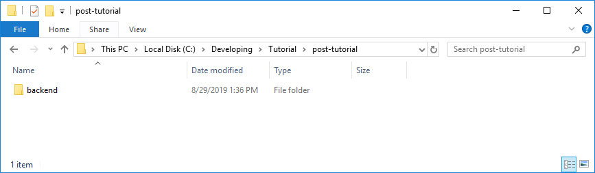

2. Open you editor, mine is VSCode, and open the folder, *backend* and then we will open up a new Terminal.
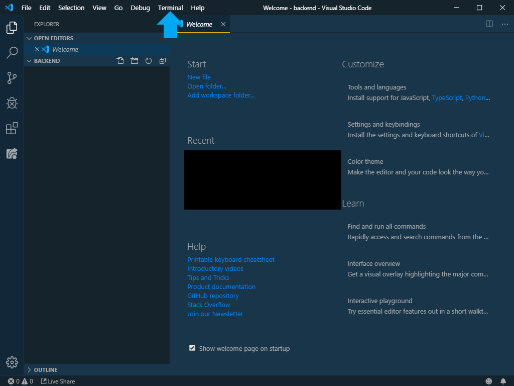

3. Once the terminal is open, we will then being creating a blank Apollo Server based on the Apollo docs. Type the following:
```
npm init --yes
```
Your output should be as followed. As you see, now you have a *package.json* file. 

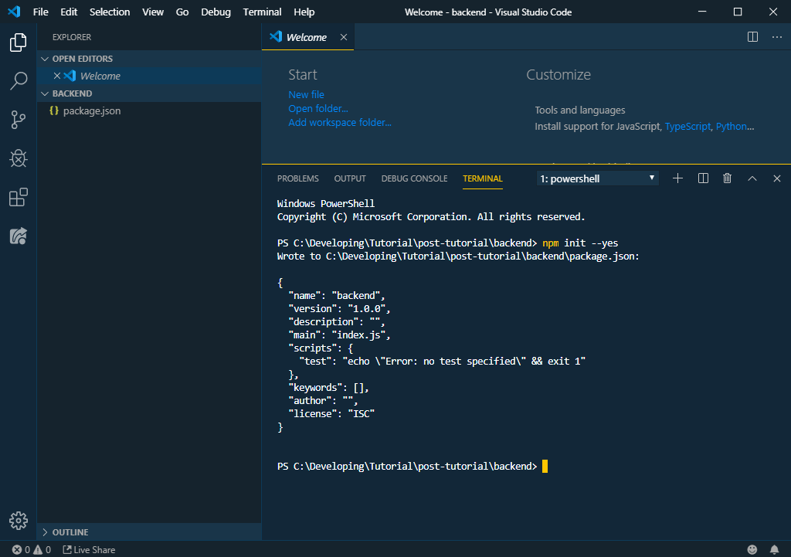

4. Next we will install our dependencies which are *apollo-server* and *graphql*.
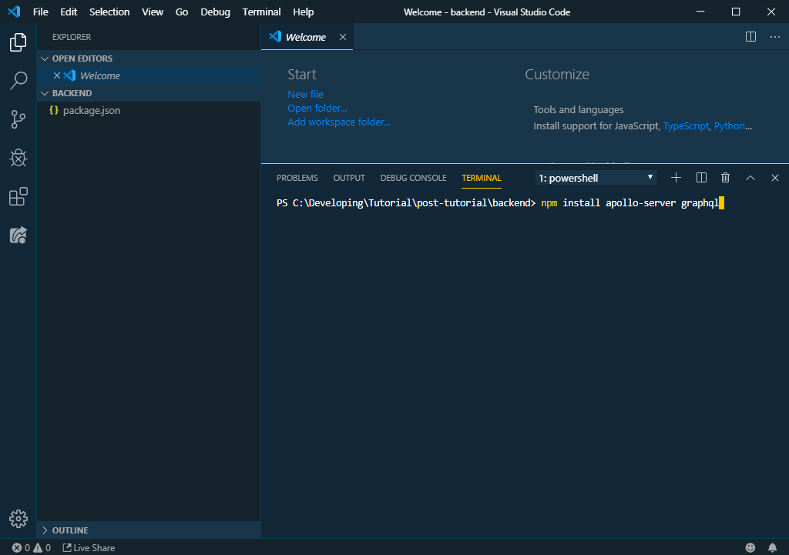

5. After the initial dependencies, we have two more to install: *dotenv* and *pg-promise*.
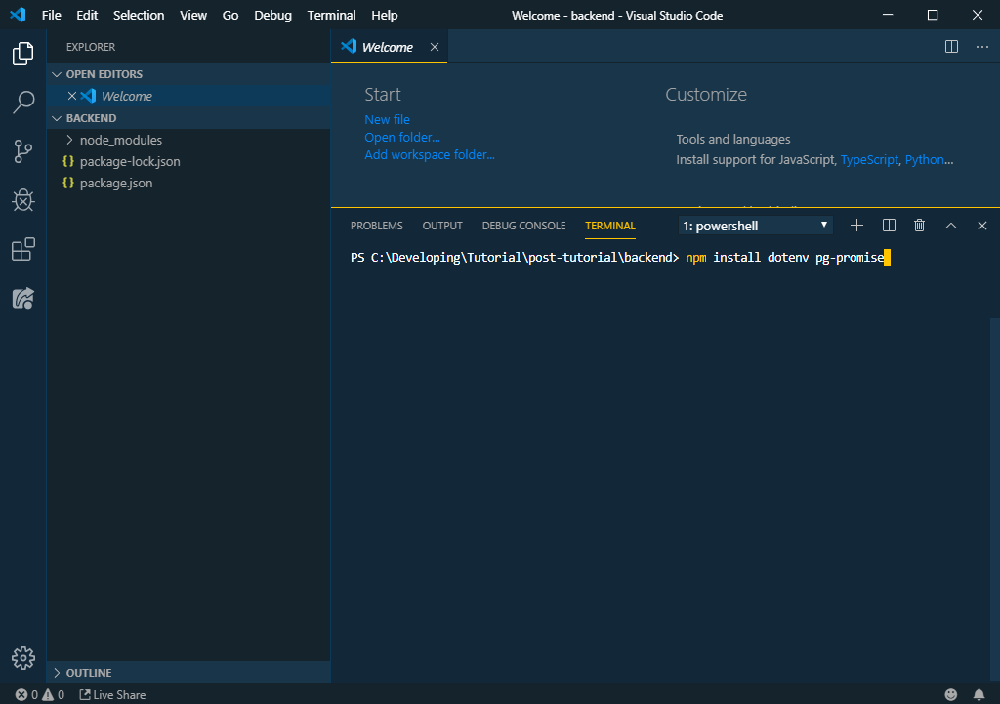

6. Now the package.json file should look like this.
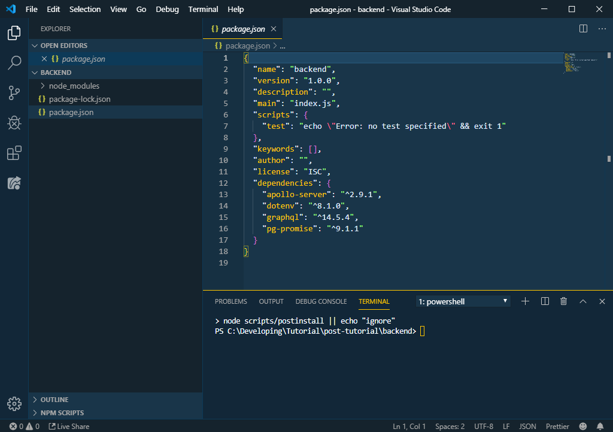

7. Now we will be creating three files to get the server up and running: *index.js*, *database.js* and *.env*. Let us start with the *.env* file because we will use the environmental variables for our *database.js* file. Our .env must be at the root of our project. We will once again go to Heroku to look at the credentials we used last time for our PgAdmin connection. I prefixed all my variables with *POSTGRES_*
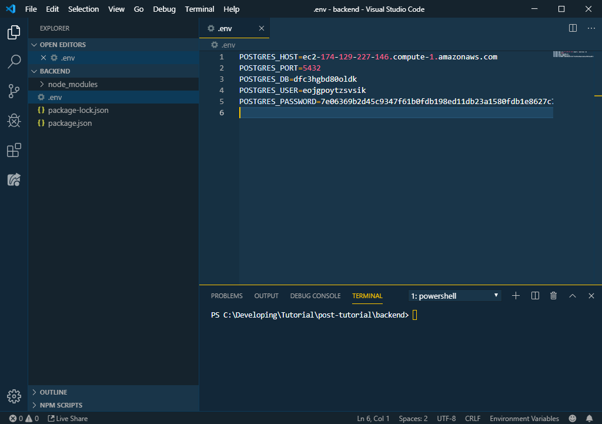

8. The next file we need to work on is the *database.js* file which contain our database. 

(Line 4)As you can see, the first thing we do is require the **dotenv** so we can have access to our *.env* file variables we created earlier. The reason we want to do this is because when we add these to our host, it can already just use the process.env to pull the data it needs from the host. We don't have to worry about changing the values manually. When you are running the server locally, it'll use the dotenv, when you are running it on a host, it'll use the environmental variables on our host, for our example, it'll be Heroku.

(Line 7)The next thing we want to do is create our instance of *pg-promise*;

(Line 10)Then we create our config that we will pass into our instance with our variables prefixed with *process.env.*

(Line 22)Finally get our db and export to be used in our main index file.

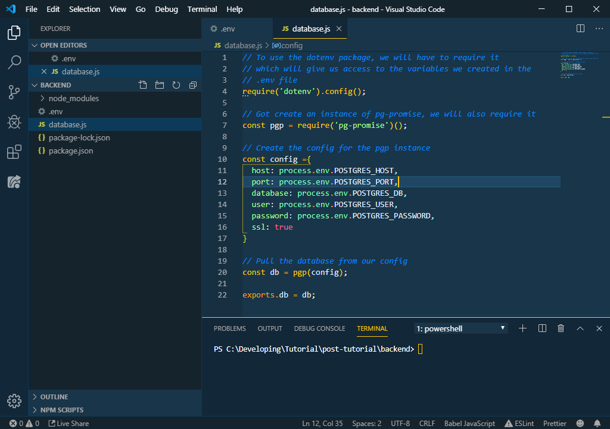

9. Before we move on to the final file, lets make a small addition to the *package.json*. 

Under the scripts object we will add the following:
```
"start": "node index.js"
```

Now after doing this, we can successfully start the server with
```
npm start
```
Once we finish our *index.js* file.
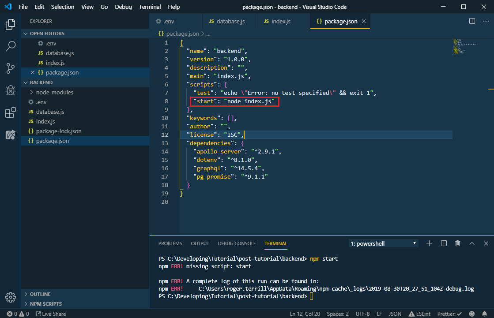

---

#### --index.js file

This file is a decent size project so I decided to break it up into it's own section. 

(Line 2) Lets begin with adding the required files for a basic Apollo Server, we will use these to run create the server and create the schema for our GraphQL as well. 
```
const { ApolloServer, gql } = require('apollo-server');
```

(Line 5) We now bring in our database from the *database.js* file
```
const { db } = require('./database.js');
```

(Line 12) As I have taken from the docs, the typeDef is the skeleton of our types in the query. We will use the gql from line 2 to create our typeDef.
```
const typeDefs = gql`
```
(Line 14) Create the type Game which mirrors exactly the columns that we created in our database. Another name for columns with relational databases is fields so hopefully that makes the transition a little more natural. 
```
type Game {
    vg_id: Int
    vg_name: String
    vg_cost: Int
    vg_genre: String
  }
```

(Line 23) We will now create our Query which will actually contain two query schemas. The first one called 'games', will return a list of Games which is shown by an array of Game. The second one is return a game by the name.
```
type Query {
    games: [Game]
    gameByName(vg_name: String!): Game
  }
```

(Line 28) Next we will now create a Mutation type schema for adding a game to the database. We call it *addGame* and since we have our database generating the id, we only worry about 3 fields: *vg_name, vg_cost, and vg_genre*.
```
type Mutation {
    addGame(
      vg_name: String!, 
      vg_cost: Int, 
      vg_genre: String
    ): Game
  }
```
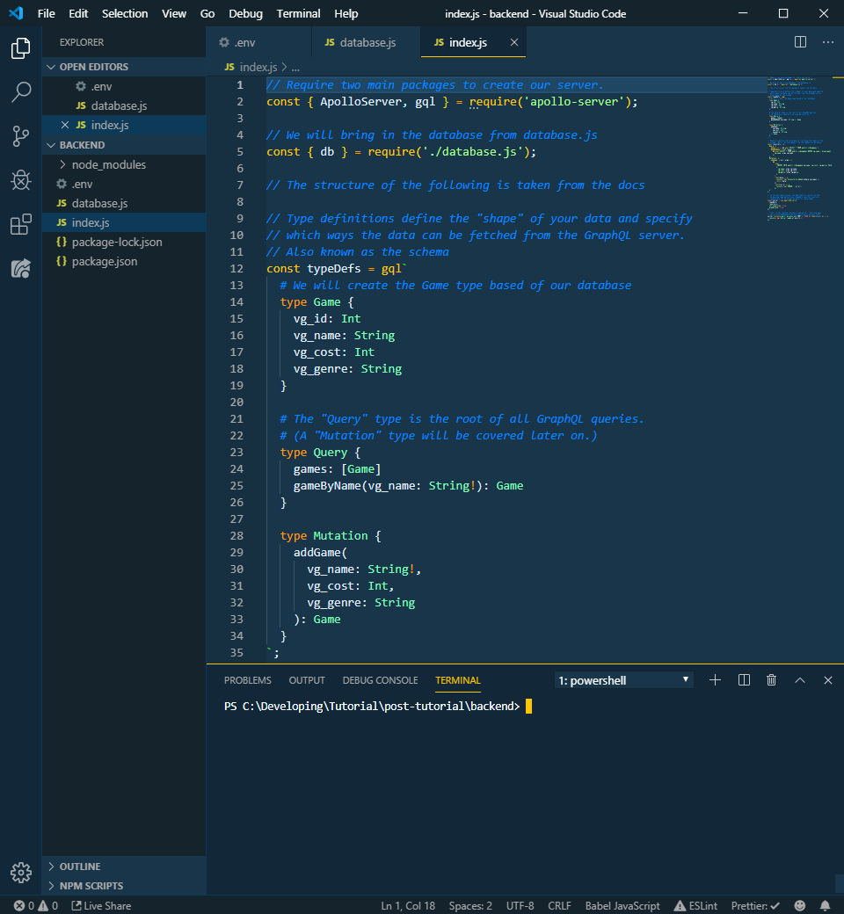

Now we that we have how our data is suppose to look, lets write the logic of how we get our data in the resolver. The next part assumes you know some basic SQL commands to help you query the data. 
(Line 39) We create a resolvers object
```
const resolvers = {
```

(Line 40) Then we create our Query object that has two queries just like our schema. The first query is to get the entire list of games. Part of the problem I had with this section is that not only was I trying to figure out the *GraphQL* syntax but also *pg-promise* syntax. For *pg-promise*, I suggest reading a little [here](https://github.com/vitaly-t/pg-promise/wiki/Learn-by-Example#simple-insert) on how to exactly use it. This helps to understand what *one* or *any* means. As you can see, we grab the database with db.any and then pass in our SQL commands to pull all the data from the database. 
```
games: () => db.any('SELECT * FROM public.videogames'),
```

(Line 42) Getting the game by its name is a little more involved but once again, SQL commands are at play. I'm still grabbing all the data but that meet a criteria. The *args* parameter that is passed corresponds to the argument used in the query. We don't actually ever use 'root' in this case. Now we have our queries setup and can grab all the games or just one game based on name in the GraphQL playground which will go into once we finish setting up the rest of the file. 
```
gameByName: (root, args) =>
      db.one('SELECT * FROM public.videogames WHERE vg_name = ${vg_name}', {
        vg_name: args.vg_name
      })
```

(Line 47) Next we head into our mutation which by far was the trickest part of this and how exactly to write the syntax. I probably spent a couple of days trying to understand this part. Hopefully this alleviates a lot of pain for you. This time I also used the *db.one* because I wanted to return just one item. The first part is just basic SQL syntax to insert a new game and then it returns if the game was succesfully added and what the name of the game is. *(NOTE: Don't do multiline like I did for the insert, that is just to display it nicely on here, if you do it will break your code, better to take a look at the image on how my code looked.)*
```
Mutation: {
    addGame: (root, args) =>
      db
        .one(
          'INSERT INTO public.videogames(vg_name, vg_cost, vg_genre) 
					VALUES(${vg_name}, ${vg_cost}, ${vg_genre}) 
					RETURNING vg_name, vg_cost, vg_genre',
          {
            vg_name: args.vg_name,
            vg_cost: args.vg_cost,
            vg_genre: args.vg_genre
          }
        )
        .then(data => {
          console.log(`Sucessfully Added ${data.vg_name}`);
          return data;
        })
        .catch(error => {
          console.log('ERROR:', error);
        })
  }
```
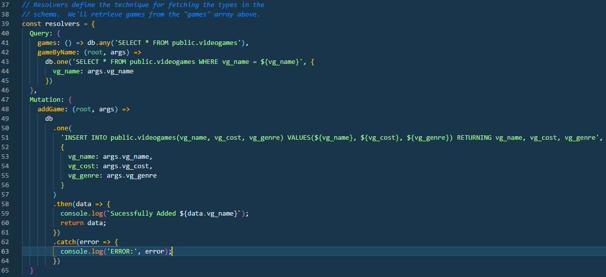

We are almost finished! Okay next onto putting together the ApolloServer Object

(Line 71) Here we create our Apollo Server with the typeDefs and Resolvers that we created but we are also going to add two more things. First is the introspection to be able to access your server once hosted on Heroku and the second is playground to be able to use the GraphQL playground to test queries and mutations. 
```
const server = new ApolloServer({
  typeDefs,
  resolvers,
  introspection: true,
  playground: true
});
```
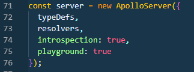


(Line 80) This is the grand finale and it is starting the server on a specified port which I chose as the default 4000. It also returns a message to verify it is running. 
```
server.listen({ port: 4000 }).then(({ url }) => {
  console.log(`Server ready at ${url}`);
});
```
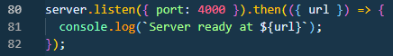

CONGRATS ONCE AGAIN! We have a local version of Apollo Server working. Later on we will move it over to Heroku but for now enjoy that you have it working locally. For now, we can run some queuries in the GraphQL playground. 

---

### --GRAPHQL PLAYGROUND!!!

So now we will get to enjoy the fruits of our labor and test out everything we just created. Let's start off with the first query that returns a list of all the games. 
1. First lets start our server by typing:
```
npm start
```
This should return the following
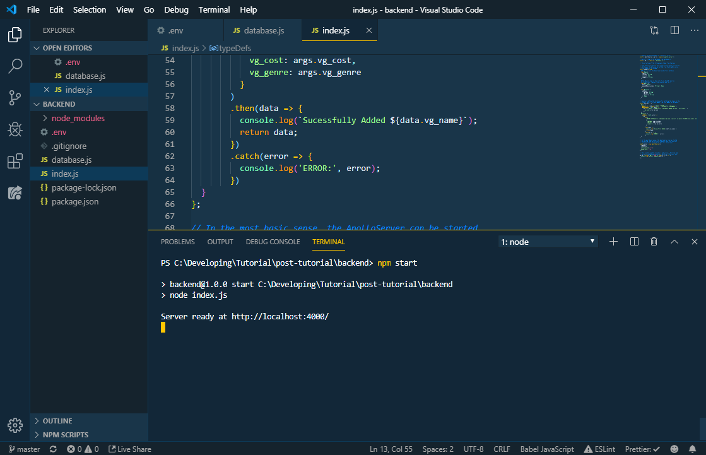

2. Once you get the Server Ready message, go on our browser address bar and type
```
http://localhost:4000/
```
You should get this beautiful screen for the playground.
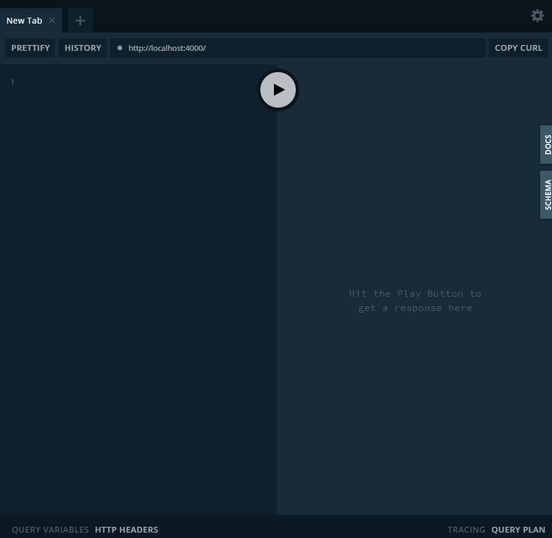

3. Let do our first query. This makes it so easy where you just type CTRL + SPACEBAR and you will get a dropdown for the available commands you have. 
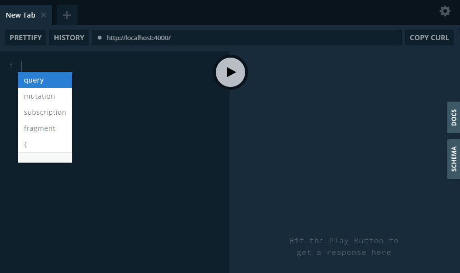

4. Another way to tell how your server is structured is to open the DOCS or SCHEMA tabs on the right.
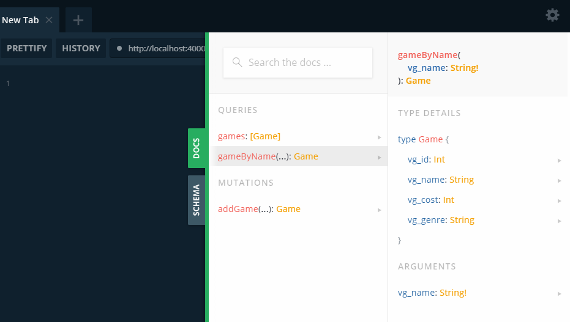

5. So we create our games query by typing the following stricly with our CTRL + SPACEBAR shorcut and then press the PLAY button. You should get the following.
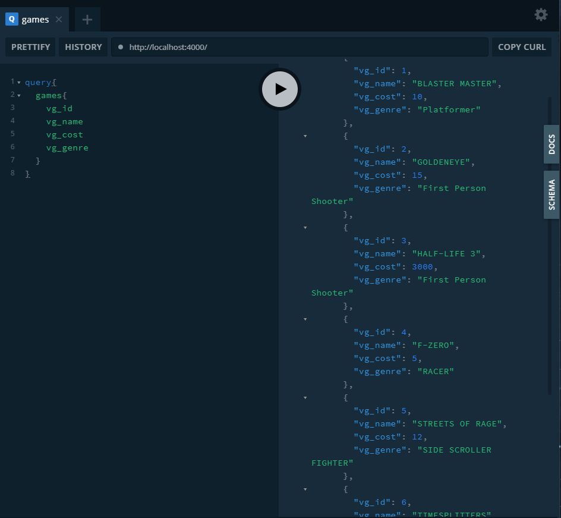

Awesome, our first official QUERY!!!

6. Next we will filter our query to only show a single game based on the name. I chose to find GoldenEye and see what the rest of the fields were. 
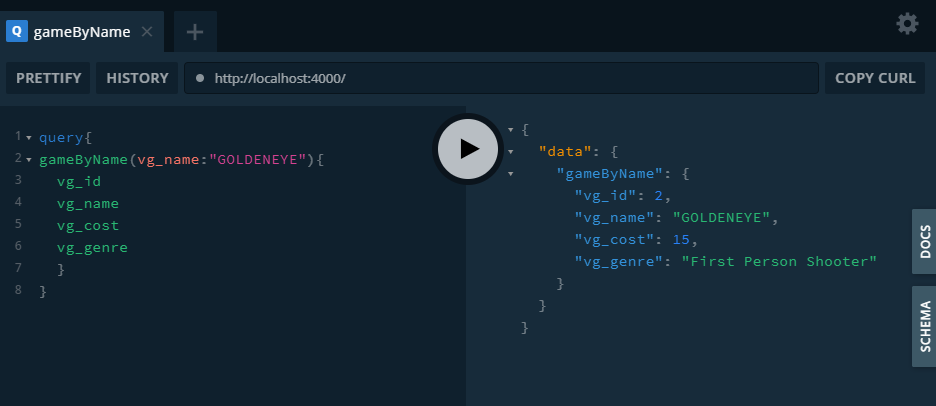

7. And finally, we will try our Mutation which is a two parter, first doing the mutation, and then reading all the games once again to see if it is in the list. First the mutation:


Now let us make sure it is in the list.
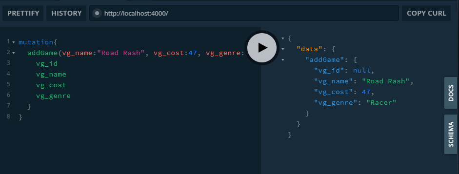

OMG, yup you just did that. I know when I did this I was on cloud 9 for as long as any developer is, 15 minutes. I hope that this really helped you build your first Apollo Server and that you can see just how amazing GraphQL is and how easy they make it to build queries. We will definitely be using this later on. For now though, take another break before we head to the belly of the beast, the frontend. 

For the final code project for this Apollo Server project, please head to my [github repo](https://github.com/RogerTerrill-Tutorials/apollo-server).

