Welcome back! So we are going to tie everything together with the frontend now which was by far the toughest part that honestly, I didn't think I could solve. There were a lot of times like in any developers career where you really do question your own skillset and this was the time that I felt that maybe I am just not good enough. Like we all know, when we feel so low and then solve the impossible, the highs reach the sky. Gatsby was a tool recommended to me by a awesome developer named Kyle which I met at a hackathon and I joined an amazing slack channel dedicated to helping veterans get into computer science. Don't know if I am allowed to say his last name so I'll keep it low key for now. Lets dive into some Gatsby first.

Before we get started, I highly recommend installing the [Apollo Client Devtools](https://chrome.google.com/webstore/detail/apollo-client-developer-t/jdkknkkbebbapilgoeccciglkfbmbnfm) for Google Chrome. It was a lifesaver for me and was the tool that helped me figure out the last problem I had before I got everything working perfectly which I'll talk about once we get there.

## --Gatsby Setup

1. Let's head back into our _post-tutorial_ folder from within VSCode, here we will now create our Gatsby starter website.
   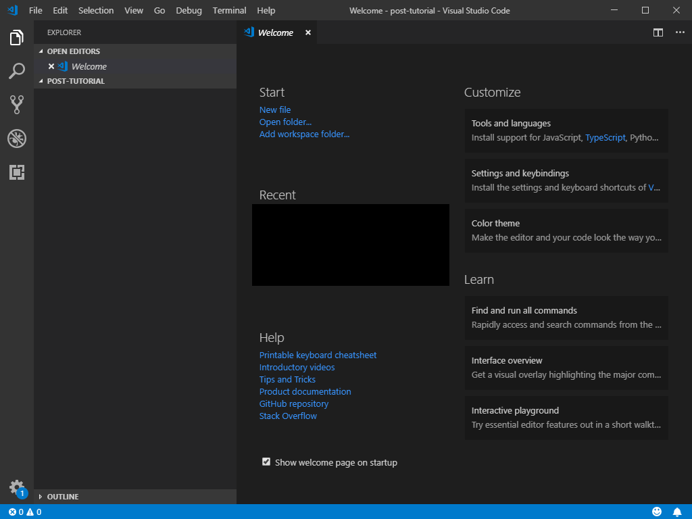

2. Open a new terminal and type in the following which comes directly from [Gatsby Starter Docs](https://www.gatsbyjs.org/docs/quick-start)

```
npm install -g gatsby-cli
```

```
gatsby new apollo-client-tutorial
```

```
cd apollo-client
```

```
gatsby develop
```

By the end you should get the following in the _Terminal_.
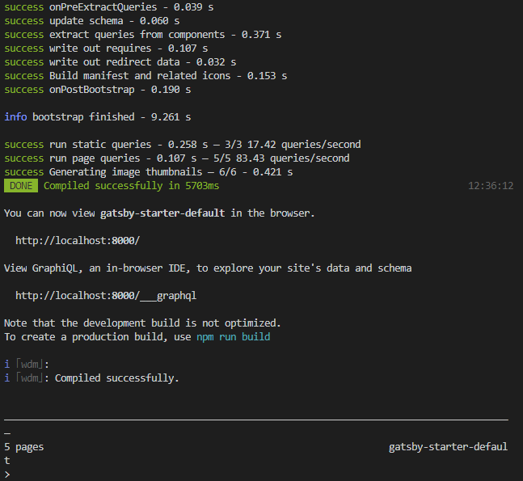

And if you go to localhost:8000, you should recieve your starter Gatsby page.
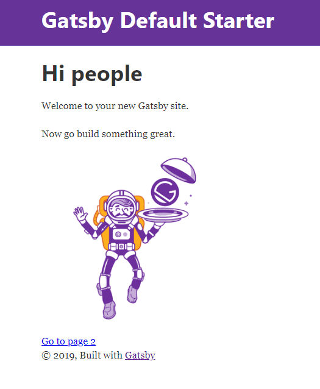

3. Great, now that we have our starter page working, time to start connecting Apollo Client to it and so the the [docs](https://www.apollographql.com/docs/react/essentials/get-started/) we go. We will now add some starter packages for Apollo Client.

```
npm install apollo-boost @apollo/react-hooks graphql isomorphic-fetch
```

So what are all the packages we are using. Taking it directly from Apollo's website:

**apollo-boost**: Package containing everything you need to set up Apollo Client

**@apollo/react-hooks**: React hooks based view layer integration

**graphql**: Also parses your GraphQL queries

**isomorphic-fetch**: Allows fetch to not only run in the browser but also Node. Check out this [video](https://youtu.be/wNUg1jpj9T0?t=1281) for why I did it, honestly, just following someone a lot smarter than me. ;)

By the end, you should have all the necessary package, now it's time to create our first file and test the connection to our database.

4. In the _src_ folder, let's create a folder called _apollo_ and within that folder create a file called _client.js_.
   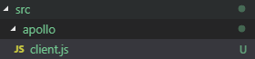

5. Now lets work on the _client.js_ file. So this is going to be a two parter. The first part we will test the connection, the second part we will rewrite the file to remove the test.

(Line 1) So lets write the headers.

```
import ApolloClient, {gql} from 'apollo-boost';
import fetch from 'isomorphic-fetch';
```

The _{gql}_ will only be used to test, we will remove it after verifying our database is connected.

(Line 5) Next we do a variable that holds either a working API address or use the local address of localhost:4000

```
const API_URI = process.env.GATSBY_API_URI || 'http://localhost:4000/';
```

(Line 8) We will now creat a ApolloClient instance.

```
export const client = new ApolloClient({
  uri: API_URI,
  fetch,
});
```

(Line 13) Finally, we will test out our client but we haven't wrapped our Gatsby project with Apollo so this test will not work, lets do that on the next step.

```
client
  .query({
    query: gql`
      {
        games {
          vg_name
        }
      }
    `
  })
  .then(result => console.log(result));
```

This file will finish and look like below.
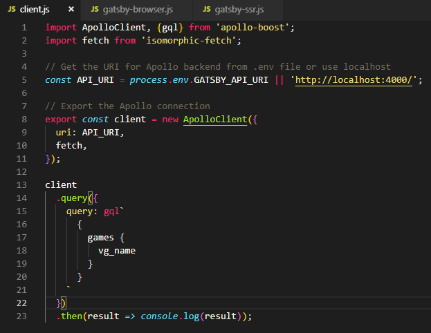

6. We will now go into two files that are already created in the root of our project: _gatsby-browser.js_ and _gatsby-ssr.js_ and add the following code to it.

```
import React from 'react';
import { ApolloProvider } from '@apollo/react-hooks';
import { client } from './src/apollo/client';
export const wrapRootElement = ({ element }) => (
  <ApolloProvider client={client}>{element}</ApolloProvider>
)
```

Yes, both files will be exactly the same.
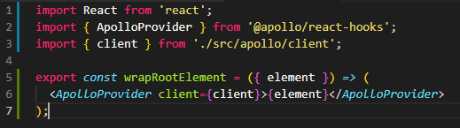

7. Now we can test our project so far. For now stop the client terminal and restart it with

```
gatsby develop
```

Then check your chrome console window to see if you successfully retrieved the data from the database. You should get the following which confirms you have successfully connected to the database.
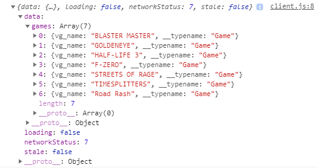

8. Now we can clean up our test code on our _client.js_ file and it should then look like this:
   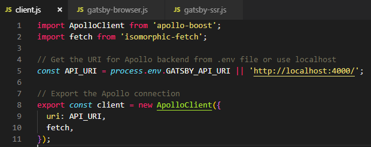

9. Now we are going to open up our index page to display all of our current games from within _src>pages>index.js_. Let's erase everything between the _Layout_ tags. It should looks like:
   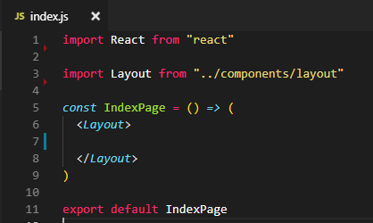

10. We will now bring in two packages:

```
import { gql } from 'apollo-boost';
import { useQuery } from '@apollo/react-hooks';
```

The first thing we do is create a query schema with Apollo:

```
const APOLLO_QUERY = gql`
  {
    games {
      vg_name
    }
  }
`;
```

Now that we have our _gql_, we will use it with our _useQuery_ package. We do this by once again following the Apollo Client docs.

```
const IndexPage = () => {
  const { loading, error, data } = useQuery(APOLLO_QUERY)
  if (loading) return <p>Loading...</p>
  if (error) return <p>Error:</p>
  return (
    <Layout>
      <ul>
        {data.games.map(game => (
          <li key={game.vg_id}>{game.vg_name}</li>
        ))}
      </ul>
    </Layout>
  )
}
```

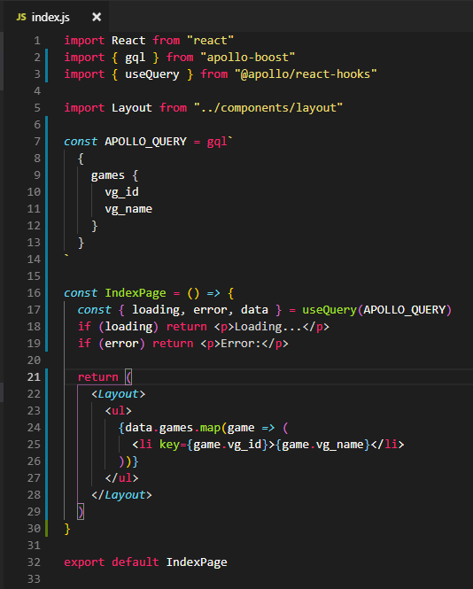

_Note:I made one major mistake when I first started using this, I left out both 'if' statements after using the Query, don't do that, it will break your code_.

As you can see, since I only used the _vg_id_ and _vg_name_, I only asked for those two in the query, but I can just as well add _vg_genre_ and _vg_cost_. Perfect, we are done with showing all the game names.

Gatsby dynamically can create pages so we are going too as well based off the name of the game. This was tricky and caused me lots of headache so let's dive in.

11. First we have to create a template that our dynamic page generator will use as a skeleton to display our games. Let's create a 'templates' folder in 'src' and add a game.js file. _src/templates/game.js_. This on is a little different as I used a gatsy plugin to query the data instead of Apollo. Honestly, I just couldn't figure out how to do it with Apollo and it was pretty seamless with Gatsby plugin. After creating your _game.js_ leave it for a moment, we will return to it.

The plugin we will be using is **gatsby-source-graphql** so we will install it with npm:

```
npm install gatsby-source-graphql
```

12. Now we go into the parts to took me sometime to figure out, we will now go into our _gatsby-config.js_ file and make some changes. When you open the file you are trying to figure out where to add the settings. Here is a before I added the settings picture.
    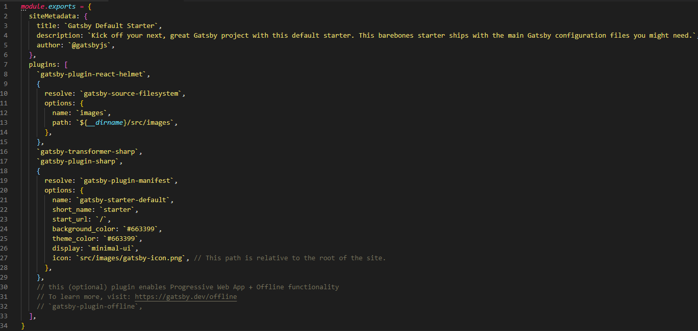

Here is the code I added afterwards.
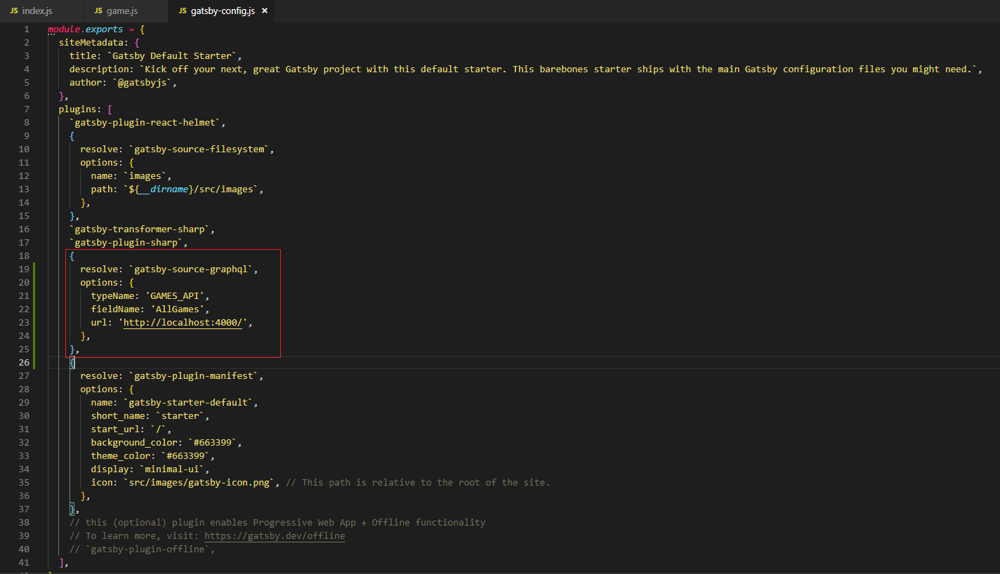

(Line 19) We said what the name of the plugin was.

(Line 20) we create an object with the name of the API and then the fieldName will by the name of the Query. Once we test it with GraphiQL you'll see what exactly that means. Our URL will change later to our hosted address but for now, we will use our local Apollo Server.

12. Now we open another file in the root name _gatsby-node.js_. This will connect our database to our Gatsby templates and is actually where we decide where our dynamic pages will be created.

(Line 1) I actually didn't know too much on why we needed this here but believe me if you remove it, it breaks your code. Upon doing some research I landed on [this](https://stackoverflow.com/questions/47458648/what-does-requirepath-means-in-webpack-config-js) Stackoverflow post.

(Line 3) We then use our [createPages API](https://www.gatsbyjs.org/docs/node-apis/#createPages) from Gatsby

(Line 4) We grab the template we will be creating shortly and assign it to _gameTemplate_.

(Line 6) We then query our database and use those results. As you can see here, our _AllGames_ matches that of the fieldName we gave on our _gatsby-config.js_.

(Line 19) Now we actually create all the pages for every item in our database.

(Line 21) This is the template we will be creating.

(Line 22) This is showing how exactly we will be getting to the pages we want, ie 'localhost:8000/game/GOLDENEYE'

(Line 24) OMG if this didn't cause me so many issues, **NOTE!!!** Make sure that the name of the object matches the name of your query argument in your template. For example, in line 24 we have _vg_name: game.vg_name_. Make sure that the first vg_name matches what would be line 6 in _game.js_ where it says _query(\$vg_name: String!)_. If both are not named the same, this will break your query.

That's it, this finishes your _gatsby.node.js_ file.
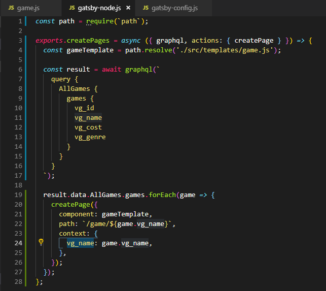

12. Now we will return to our _game.js_ template file and the file that will wrap up our dynamic pages.

(Line 1) We bring in the packages we need to get it working but of not is that we are using gatsby's graphql which is tied to the plugin we installed.

(Line 5) We then export our query that specifies a single game. This was such a mind bender for me and it took me days to really understand how to design the query with arguments. As I said in Line 24 of the _gatsby-node.js_ file steps, make sure you name the query argument the same as the context. The simplest way I found is just to make sure all are named the same, don't title one _name_ and another _video_game_name_. Just keep it simple and consistent, _vg_name_.

(Line 7) Again, we use the fieldName that we decided on in the _gatsby-config.js_ file of AllGames and the rest of the query matches as well.

(Line 17) We create the component and pass in data as that is our data from our table.

(Line 18) Using that _data_ argument, we parse the table until we reach our _gameByName_ and assign it to _game_.

(Line 21) Finally, you can see the basic HTML of how or page should look.
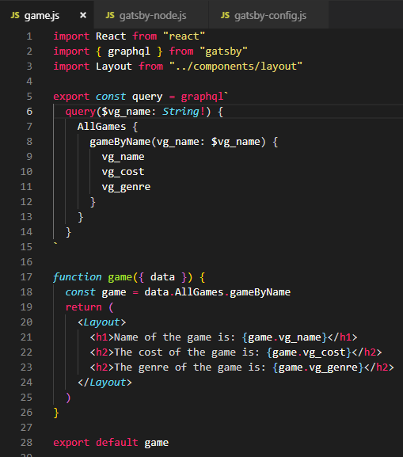

13. Now it is time to make sure our code works. First thing first, has it compiled successfully, if yes, then lets do our first single game check. In your address bar type:

```
http://localhost:8000/game/GOLDENEYE
```

You should see the following and you'll know you have successfully built your dynamic pages.  
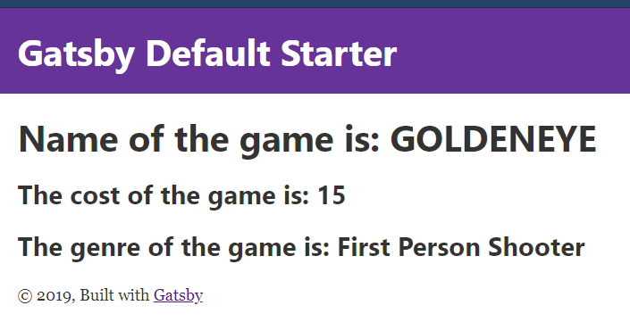

Keep in mind that you'll have to redeploy your gatsby project everytime you add a new game since the pages are created on deploy. Speaking of adding a new game, yup, we are going to do that next.

This was the part that had me questioning my own skills and whether I was cut out for this after 4 years. Luckily, it did not beat me and so I bring you how to do mutations and add games to your database.

14. First create a new page called _addgame.js_.

My first recommendation is to add the [Apollo Dev Tool](https://chrome.google.com/webstore/detail/apollo-client-developer-t/jdkknkkbebbapilgoeccciglkfbmbnfm) Extension for chrome. Once again, it was my lifesaver.

(Line 1) We are now dealing with state so we will use React Hooks which are kinda new but amazing to use. Just like we used _useQuery_ we will now use _useMutation_.

(Line 5) So here is what can get a little messy which is our mutation, first we name our Mutation and add the variables and their types respectively.

(Line 7) Next is bringing in the actual mutation and the variables for each.

(Line 8-11) Is what will be returned once the mutation successfuly gets applied which in our case, it's adding a game.

(Line 16) This is the beginning of our component

(Line 18) We start our use of _useMutation_ and pass in the ADD_GAME gql mutation. You can also check out to build your mutation witht the Apollo Developer Tool.
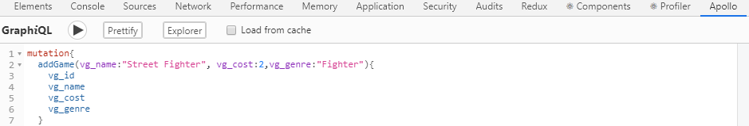

(Line 20) Since we are using a form, that usually means we need state and in our case, we will use the useState hooks to make it easier. I could have done each input as a different state but found this to be faster since I won't have to make a different changeHandler for each field.

(Line 26) This takes care of all of our fields and have the state update when something is added to the field. I use the spread operator to keep track of all the fields because if you don't, it'll only update one field while overwriting others.

(Line 30) We then create a submit handler which will use the addGame from line 18 mutation. We use event.preventDefault() so it doesn't reload the browser.

(Line 36) Don't forget that our cost was an Int and not a String so we cast our string to Int so it successfully gets added to our database.
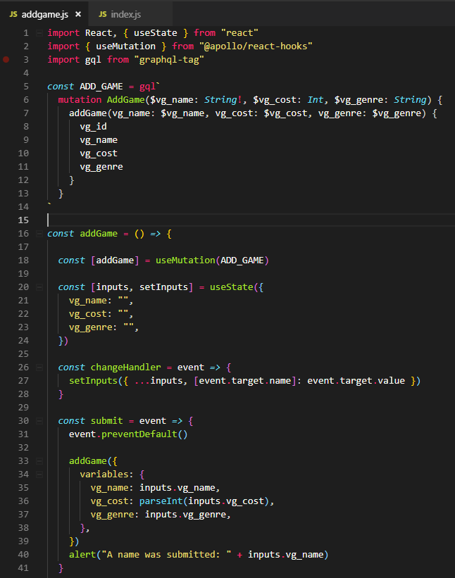

(Line 44) I use _<React.Fragment>_ so I don't have to use filler _<div>_ but you can use either.

(Line 49) These are important because it is how our line 27 determines which field to change based on what field is being typed on.

(Line 59) As you can see, instead of having many event handlers for each field, they are all the same and just rely as I said before, the name of the input field.

(Line 70) Finally we do an onClick event and assign it to our created _submit handler_ from line 30.
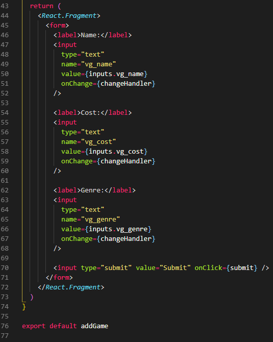

The time has come, can we add a game...

15. Once again, just restart your gatsby environment then on your address bar go to:

```
http://localhost:8000/addgame
```

You should see the following screen.
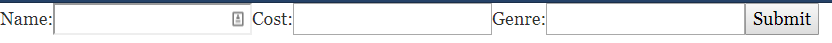

16. Add a game of your choice, I have added the following.
    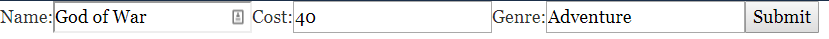

17. You should then see a popup of the name of the game.
    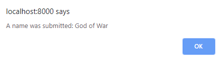

18. Now go to your home page of localhost:8000 and see if you game has been added. I added other games but the last one you should see matches. I have to say, this was the most amazing feeling when I did this!
    ![gameadded].js](apollo-client-022.png)

19. We are almost done but now we have to make sure it is also added to our dynamic pages. Remember, you must redeploy your app to let gatsby create the page. So stop your server with CTRL+C and reploy it with :

```
gatsby deploy
```

Then go to:

```
localhost:8000/game/God%20of%20War
```

Note: the %20 acts as spaces and the address is Case Sensitive
![gamepage created].js](apollo-client-023.png)

---

HOLY MOLY, We did it! We have a database, an Apollo Backend Server and a Gatsby Frontend with Apollo Client. This was weeks of me trying to figure how this all worked but then I remember thinking, how do people put this on the interwebs for the world to see. Finally, we finish with moving the backend to Heroku and the frontend to Netlify.

We are at the final mile! To see the final code, here is the [github repo](https://github.com/RogerTerrill-Tutorials/apollo-client-gatsby). THANKS!
