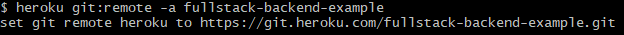
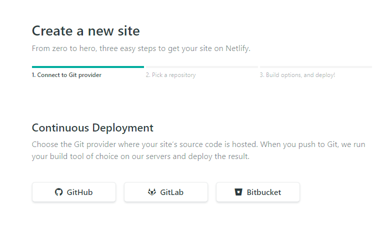

So this is it! We are now going to put our code for the world to see! This was at first really intimidating, especially with services like Heroku that do everything by command line but I found that it was easier that I could have imagined. Let's get right into it. 

## Backend Hosting with Heroku

NOTE: Before we can do this, go to your *Apollo-Server* project and we need to make one small change to our index.js file. On line 80, we need to change it from:
```
server.listen({ port: 4000 }).then(({ url }) => {
```
and change it to:
```
server.listen({ port: process.env.PORT || 4000 }).then(({ url }) => {
  ```
This will allow it to attach to Heroku's address. 

---

1. First thing you want to do is download and install the [Heroku CLI](https://devcenter.heroku.com/articles/heroku-command-line)

2. Go back to Heroku.com and once in your Heroku Dashboard, Click on our app which is *fullstack-backend-example*.


3. Then go to *Deploy*


4. On this screen under the *Deploy using Heroku Git* we see how to upload our project. 
```
$ cd my-project/
$ git init
$ heroku git:remote -a fullstack-backend-example
```
I opened my command line right in the folder I had my backend project which in our case is the *Apollo-Server* folder and typed:
```
heroku login
```
This will ask you to press a key to open up the browser and it'll then log your command line into your account. 

Once you are done loggin in, type:
```
git init
heroku git:remote -a fullstack-backend-example
```
You will then see


5. Then you will add to your git, commit it and push it to heroku and that's it!
```
$ git add .
$ git commit -am "make it better"
$ git push heroku master
```
At the end of the command line, you will get an address to check if you successfully put your code on the INTERWEBS! For our example, the code is:
```
 https://fullstack-backend-example.herokuapp.com/
```

WARNING!: This might not work just yet...WHY!? Well because we don't have a .env file in our project anymore. So what does this mean, well it means we will use Environmental Variables within Heroku. 

6. Setting up your Environmental variables is pretty easy. Go to your app settings and just make sure they match your .env naming convention. 


7. Now, we go to the above site and do a simple query and SUCCESS!!!

Keep in mind we will now use this address in our frontend but where or where. I'll get to that next.

---
### Frontend Hosting with Netlify

Now that we have our backend on Heroku, lets host our frontend on Netlify. 

1. The first thing you have to do is create a repo on *Github* as we will connect this repo to Netlify. Then go to Netlify.com, create an account and click on: 


2. Next we have choices of a Git Repo we want to use, we will use GitHub in our case.


3. Then we will add a repo which in my case, it's the following:


4. You will then end up at this screen, just click 'Desploy site' and wait, but we are not done yet.


5. Most likely it will fail because we haven't added the environmental variables so lets do that now. Go to 'Settings' on top, and 'Build and Deploy' on the side then 'Environment' and I will insert the following which the variable comes from the client.js file and the address is that of our backend on Heroku. 


6. After adding this we will also change the url on our graphql plugin in the *gatsby-config.js* file in our root.

(Line 23) Will now change to
```
url: process.env.GATSBY_API_URI || 'http://localhost:4000',
```


7. Now we retrigger our deployment and wait to see the glorious green notification of...PUBLISHED.
[Variables](hosting-012.png)

8. You can check your pgAdmin, GraphQL PlayGround, HomePage, everything we have created, it will work beautifully on the site that Netlify gives us which is for me:
```
https://agitated-tesla-ae1c1f.netlify.com/
```

SUCCESS!!! WE ARE DONE!

The awesome thing about Netlify is it is free for small projects and all you have to do is push it to your git and it will update your page. Don't forget, you have to manually redeploy for any new games you add. 

---

Reflecting on this project, it was a lot of pain and anguish but this is the first time I have felt like I have something worth sharing and I really do hope it helps others out there that had the same problem I did, so many technologies, how do they all come together. If you have any questions, [tweet me](https://twitter.com/Roger_Terrill). By no means is this the one way to do it and there are most likely a lot better ways but like Frank Sinatra says, "I did it my way". 

