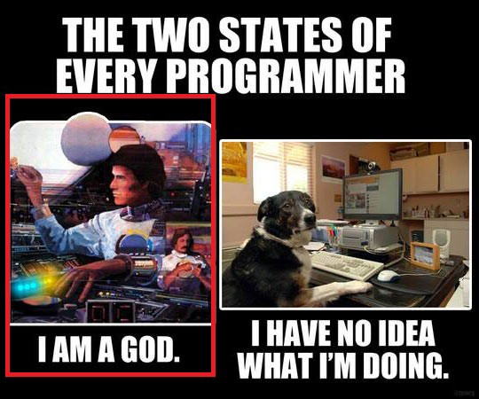

So I’m going through the node bootcamp portion and we have been learning routes which wow, so that is how I see 404 errors working, I could be wrong though. The next thing we learn is how to use express, ejs and body-parser to go through data. Finally, it has been demystified what xml and json was and wow did it open a brand new world for me. Seriously, why didn’t someone tell me how awesome api’s were. Truth be told I always wondered how people made apps that full weather, location, etc. I figured those people were geniuses but like any magic trick, once you learn the trick you say to yourself…”thats it!”

Through the web developer bootcamp on udemy with Colt Steele, which I find to be one of the most amazing courses I have ever taken, we got to APIs which even made him gitty. We built a movie web app that returns 10 movies with a certain title from omdbapi.com. I went through all the steps, built it and the first thing I do is show my wife which she thought it was pretty cool as well. It just blew my mind wide open to the possibilities. One of the was I had built an android app for her to show only movies she liked in our library that would randomly show a title by clicking a button on it. Every once in a while the title would just be a small love phrase for her. The problem with this app was that the array of movies was built within the app. NOW, I have decided to build her a responsive website with a mondoDB of her movies so she never has to worry about switching phones. Again, the world is MINE now with APIs. Still haven’t gotten to the database portion of the course but when I do it is going to be glorious.

On a side note, there is this car wash guy next door who comes every Wednesday. I see that he gets out his van and people come up to him and her writes down names, cost, and times to finish. My idea was why not use an online booking service so he could automate all that and eventually create a database of people. I know the easiest way is WordPress but I really wanted to make it from scratch. On looking online it seems it might be a monumental task so I might bring it up to him so at least he knows it can be made. Anyways, back to my course but right now. I feel like the picture below.

